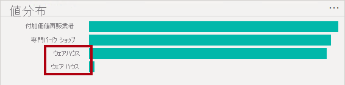

---
lab:
  title: Obter Dados no Power BI Desktop
  module: Get Data in Power BI
---

# Obter Dados no Power BI Desktop

## **História do laboratório**

Este laboratório foi projetado para apresentar você ao aplicativo Power BI Desktop e mostrar como se conectar a dados e como usar técnicas de visualização de dados para entender as características e a qualidade dos dados de origem. Os objetivos de aprendizagem são:

- Abrir o Power BI Desktop
- Conectar-se a diferentes fontes de dados
- Pré-visualizar dados de origem com o Power Query
- Usar recursos de criação de perfil de dados no Power Query

**Este laboratório levará aproximadamente 30 minutos.**

## Introdução ao Power BI Desktop

Para concluir este exercício, primeiro abra um navegador da Web e insira a seguinte URL para baixar a pasta zip:

`https://github.com/MicrosoftLearning/PL-300-Microsoft-Power-BI-Data-Analyst/raw/Main/Allfiles/Labs/01-prepare-data-with-power-query-in-power-bi-desktop/01-prepare-data.zip`

Extraia a pasta para a pasta **C:\Users\Student\Downloads\01-prepare-data**.

Abra o arquivo **01-Starter-Sales Analysis.pbix**.

- O arquivo inicial foi especialmente configurado para ajudar você a concluir o laboratório. As seguintes configurações em nível de relatório foram desabilitadas no arquivo inicial:

  - Carregar Dados > Importar relacionamentos de fontes de dados no primeiro carregamento
  - Carregamento de Dados > Detectar automaticamente novos relacionamentos depois que os dados são carregados

## Obter dados do SQL Server

Esta tarefa ensina como se conectar a um banco de dados do SQL Server e importar tabelas, que criam consultas no Power Query.

1. Na guia de faixa de opções **Página Inicial**, no grupo **Dados**, selecione **SQL Server**.

     

1. Na janela **Banco de dados do SQL Server**, na caixa **Servidor**, insira **localhost**, deixe **Banco de Dados** em branco e selecione **OK**.

    > ***Observação**: neste laboratório, você se conectará ao banco de dados do SQL Server usando ** localhost** porque as fontes de dados de gateway não podem resolver **localhost**. Essa não é uma prática recomendada ao criar suas próprias soluções.*

1. Se forem solicitadas credenciais, selecione **Windows > Usar minhas credenciais atuais** e **Conectar**.

1. Clique em **OK** se você receber um aviso dizendo que uma conexão criptografada não pode ser estabelecida.

1. No painel **Navegador**, expanda o banco de dados **AdventureWorksDW2020**.

    > ***Observação**: o banco de dados **AdventureWorksDW2020** é baseado no banco de dados de exemplo **AdventureWorksDW2017**. Ele foi modificado para ficar compatível com os objetivos de aprendizado dos laboratórios do curso.*

1. Selecione a tabela **DimEmployee** e observe a pré-visualização dos dados da tabela.

     

    > ***Observação**: a pré-visualização de dados exibe as colunas e uma amostra de linhas.*

1. Para importar os dados da tabela, **marque a caixa de seleção** ao lado das seguintes tabelas:

    - DimEmployee
    - DimEmployeeSalesTerritory
    - DimProduct
    - DimReseller
    - DimSalesTerritory
    - FactResellerSales

1. Conclua esta tarefa selecionando **Transformar dados**, que abrirá o Editor do Power Query. Deixe o editor aberto para a próxima tarefa.

Agora você se conectou a seis tabelas a partir de um banco de dados do SQL Server.

## **Pré-Visualizar Dados no Editor do Power Query**

Esta tarefa apresenta o Editor do Power Query e permite a você analisar e criar o perfil dos dados. Isso ajuda a determinar como limpar e transformar os dados posteriormente. Você também revisará as tabelas de dimensão prefixadas com "Dim" e as tabelas de fatos prefixadas com "Fato".

1. Na janela **Editor do Power Query**, à esquerda, observe o painel **Consultas**. O painel **Consultas** contém uma consulta para cada tabela selecionada.

     

1. Selecione a primeira consulta - **DimEmployee**.

    > *A tabela **DimEmployee** no banco de dados do SQL Server armazena uma linha para cada funcionário. Um subconjunto das linhas dessa tabela representa os vendedores, que serão relevantes para o modelo que você desenvolverá.*

1. No canto inferior esquerdo, na barra de status, algumas estatísticas da tabela são concedidas: a tabela tem 33 colunas e 296 linhas.

     

1. No painel de visualização de dados, role horizontalmente para examinar todas as colunas. Observe que as últimas cinco colunas contêm links de **Tabela** ou **Valor**.

    > *Essas cinco colunas representam relações com outras tabelas no banco de dados. Eles podem ser usados para unir mesas. Você ingressará em tabelas no laboratório **Carregar Dados Transformados no Power BI Desktop**.*

1. Para avaliar a qualidade da coluna, na guia **Exibição** da faixa de opções, dentro do grupo **Visualização de Dados**, marque **Qualidade da Coluna**. O recurso da qualidade da coluna permite que você determine facilmente o percentual de valores válidos, com erro ou vazios.

     

1. Observe que a coluna **Posição** tem 94% de linhas vazias (nulas).

     

1. Para avaliar a distribuição da coluna, na guia **Exibição** da faixa de opções, dentro do grupo **Visualização de Dados**, marque **Distribuição da Coluna**.

1. Examine a coluna **Posição** novamente e observe que há quatro valores distintos e um valor exclusivo.

1. Examine a distribuição de coluna para a coluna **EmployeeKey** - há 296 valores distintos e 296 valores exclusivos.

     

    > ***Observação**: quando as contagens distintas e exclusivas são as mesmas, isso significa que a coluna contém valores exclusivos. Ao modelar, é importante que algumas tabelas do modelo contenham colunas exclusivas. Essas colunas exclusivas podem ser usadas para criar relações um-para-muitos, o que você fará no laboratório **Modelar dados no Power BI Desktop**.*

1. No painel **Consultas**, selecione a consulta **DimProduct**.

    > *A tabela **DimProduct** contém uma linha por produto vendido pela empresa.*

1. No painel **Consultas**, selecione a consulta **DimReseller**.

    > *A tabela **DimReseller** contém uma linha por revendedor. Os revendedores vendem, distribuem ou agregam valor aos produtos da Adventure Works.*

1. Para exibir valores da coluna, na guia **Exibição** da faixa de opções, dentro do grupo **Visualização de Dados**, marque **Perfil da Coluna**.

1. Selecione o cabeçalho da coluna **BusinessType** e observe o novo painel abaixo do painel de visualização de dados. Examine as estatísticas da coluna e a distribuição de valor no painel de pré-visualização de dados.

    > *Observe o problema de qualidade dos dados: há dois rótulos para warehouse (**Warehouse** e **Ware House**, com a grafia incorreta).*

     

1. Passe o mouse sobre a barra **Ware House** e observe que há cinco linhas com esse valor.

1. No painel **Consultas**, selecione a consulta **DimSalesTerritory**.  

    > *A tabela **DimSalesTerritory** contém uma linha por região de vendas, incluindo **Sede Corporativa** (matriz). As regiões são atribuídas a um país e os países são atribuídos a grupos. No laboratório **Dados de Modelo no Power BI Desktop**, você criará uma hierarquia para dar suporte à análise em nível de região, país ou grupo.*

1. No painel **Consultas**, selecione a consulta **FactResellerSales**.

    > *A tabela **FactResellerSales** contém uma linha de pedido de venda por linha. Um pedido de venda contém um ou mais itens de linha.*

1. Examine a qualidade da coluna **TotalProductCost** e observe que 8% das linhas estão vazias.

    > *Os valores ausentes de **TotalProductCost** são um problema de qualidade de dados.*

## **Obter dados de um arquivo CSV**

Nesta tarefa, você criará uma nova consulta com base em arquivos CSV.

1. Para adicionar uma nova consulta, na janela do **Editor do Power Query**, na guia de faixa de opções **Página Inicial**, no grupo **Nova Consulta**, escolha a seta para baixo **Nova Fonte** e selecione **Texto/CSV**.

1. Navegue até o arquivo **01-prepare-data > ResellerSalesTargets.csv**. Selecione **Abrir**.

1. Na janela **ResellerSalesTargets.csv**, examine os dados da pré-visualização. Selecione **OK**.

1. No painel **Consultas**, observe a adição da consulta **ResellerSalesTargets**.

    > *O arquivo CSV **ResellerSalesTargets** contém uma linha por vendedor, por ano. Cada linha registra 12 metas de vendas mensais (expressas em milhares). O ano comercial da empresa Adventure Works começa em 1º de julho.*

1. Observe que nenhuma coluna contém valores vazios.  Quando não há uma meta de vendas mensal, um caractere de hífen é armazenado em seu lugar.

1. Examine os ícones de cada cabeçalho de coluna à esquerda do nome da coluna. Os ícones representam o tipo de dados da coluna. **123** é número inteiro e **ABC** é texto.

     

1. Repita as etapas para criar uma consulta baseada no arquivo **ColorFormats.csv**.

    > *O arquivo CSV **ColorFormats** contém uma linha por cor do produto. Cada linha registra os códigos HEX para formatar as cores do plano de fundo e da fonte.*

Agora você terá duas novas consultas, **ResellerSalesTargets** e **ColorFormats**.

 

## Laboratório concluído
