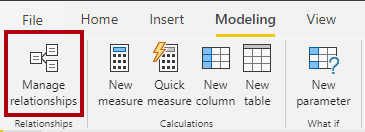
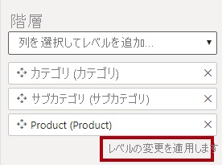
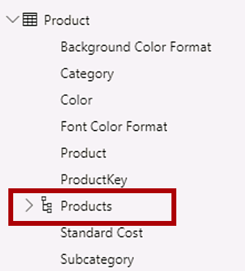
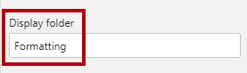
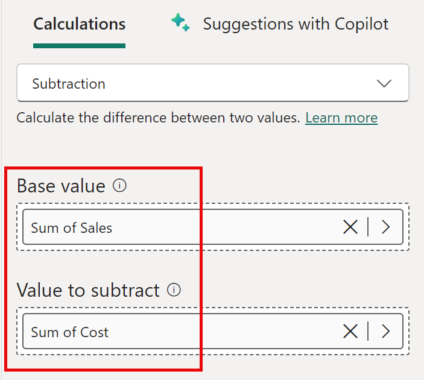

---
lab:
  title: "Criar um modelo de\_dados\_no Power BI"
  module: Design a Data Model in Power BI
---

# Criar um modelo de dados no Power BI

## **História do laboratório**

Neste laboratório, você começará a desenvolver o modelo de dados. Ele envolverá a criação de relações entre tabelas e, em seguida, a configuração de propriedades de tabela e de coluna a fim de melhorar a usabilidade do modelo de dados e torná-lo mais amigável. Você também criará hierarquias e criará medidas rápidas.

Neste laboratório, você aprenderá a:

- Criar relações de modelo
- Configurar propriedades de tabela e de coluna
- Criar hierarquias

**Este laboratório levará aproximadamente 45 minutos.**

## **Introdução**

Nesta tarefa, você vai configurar o ambiente para o laboratório.

1. Abra o Power BI Desktop.

    

    *Dica: por padrão, a caixa de diálogo Introdução é aberta na frente do Power BI Desktop. Você pode optar por entrar e, em seguida, fechar o pop-up.*

1. Para abrir o arquivo inicial do Power BI Desktop, selecione **Arquivo > Abrir Relatório > Procurar Relatórios**.

1. Navegue até a pasta **D:\PL300\Labs\03-configure-data-model-in-power-bi-desktop\Starter** e selecione o arquivo **Análise de Vendas**.

1. Feche todas as janelas informativas que possam ser abertas.

1. Vá para **Arquivo > Salvar Como** e salve o arquivo na pasta **D:\PL300\MySolution**.

## **Criar relações de modelo**

Nesta tarefa, você criará relações de modelo. O arquivo foi configurado para não identificar relações entre tabelas nos laboratórios anteriores. Essa não é a configuração padrão, mas é recomendada para evitar trabalho extra criando as relações corretas para seu modelo.

*Importante: os laboratórios usam uma notação abreviada para fazer referência a um campo. Ficará assim: **Produto \| Categoria**. Neste exemplo, **Produto** é o nome da tabela e **Categoria** é o nome do campo.*

1. No Power BI Desktop, à esquerda, selecione o ícone de exibição de **Modelo**.

     

1. Se você não vir todas as sete tabelas, role horizontalmente para a direita e, em seguida, arraste e organize as tabelas mais próximas para que elas possam ser vistas simultaneamente.

     *Dica: use também o controle de zoom localizado na parte inferior da janela.*

1. Para voltar à exibição de Relatório, à esquerda, selecione o ícone de **exibição de Relatório**.

     

1. Para exibir todos os campos de tabela, no painel **Data**, clique com o botão direito do mouse em uma área vazia e, em seguida, selecione **Expandir Tudo**.

1. Para criar um visual de tabela, no painel **Data**, dentro da tabela **Produto**, marque o campo **Categoria**.

1. Para adicionar uma coluna à tabela, no painel **Data**, marque o campo **Vendas \| Vendas**.

1. Observe que o visual de tabela lista quatro categorias de produto e que o valor das vendas é o mesmo para cada uma delas e o mesmo para o total.

    *A questão é que a tabela é baseada em campos de tabelas diferentes. A expectativa é que cada categoria de produto exiba as vendas para aquela categoria. No entanto, como não há uma relação de modelo entre essas tabelas, a tabela **Vendas** não é filtrada. Agora você adicionará uma relação para propagar filtros entre as tabelas.*

     

1. Na guia de faixa de opções **Modelagem**, no grupo **Relações**, selecione **Gerenciar Relações**.

     

1. Na janela **Gerenciar Relações**, observe que nenhuma relação está definida ainda.

1. Para criar uma relação, escolha **Nova**.

1. Na janela **Criar Relação**, na primeira lista suspensa, selecione a tabela **Product**.

     

1. Na segunda lista suspensa (abaixo da grade de tabela **Product**), selecione a tabela **Sales**.

     

1. Observe que as colunas **ProductKey** em cada tabela foram selecionadas automaticamente.

    *As colunas foram selecionadas porque compartilham o mesmo nome e tipo de dados. Talvez seja necessário encontrar colunas correspondentes com nomes diferentes em dados reais.*

1. Na lista suspensa **Cardinalidade**, observe que a opção **Um-Para-Muitos (1:*)** está selecionada.

    *A cardinalidade foi detectada automaticamente, porque o Power BI entende que a coluna **ProductKey** da tabela **Produto** contém valores exclusivos. As relações um-para-muitos são a cardinalidade mais comum, e todas as relações que você criar neste laboratório serão desse tipo.*

1. Na lista suspensa **Direção do Filtro Cruzado**, observe que a opção **Única** está selecionada.

    *Direção de filtro único significa que os filtros se propagam do "um lado" para o "lado muitos". Nesse caso, isso significa que os filtros aplicados à tabela **Produto** serão propagados para a tabela **Vendas**, mas não na direção oposta.*

1. Observe que a opção **Tornar Essa Relação Ativa** está marcada.

    *As relações ativas propagam filtros. É possível marcar um relacionamento como inativo para que os filtros não se propaguem. Relacionamentos inativos podem existir quando há vários caminhos de relacionamento entre tabelas. Nesse caso, os cálculos de modelo podem usar funções especiais para ativá-los.*

1. Selecione **OK**, na **Gerenciar Relações**, observe que a nova relação está listada e selecione **Fechar**.

1. Observe que agora há um conector entre as duas tabelas (não importa se as tabelas estão posicionadas uma ao lado da outra).
    1. É possível interpretar a cardinalidade, que é representada pelos indicadores **1** e **(*)**.
    1. A direção do filtro é representada pela ponta da seta.
    1. Uma linha sólida representa uma relação ativa, enquanto uma linha tracejada representa uma relação inativa.
    1. Focalize o cursor sobre a relação para destacar as colunas relacionadas.

     

     Há uma forma mais fácil de criar uma relação. No diagrama de modelo, é possível arrastar e soltar colunas para criar uma relação.

1. Para criar uma nova relação usando uma técnica diferente, na tabela **Revendedor**, arraste a coluna **ResellerKey** para a coluna **ResellerKey** da tabela **Vendas**.

    *Dica: às vezes, não é possível arrastar uma coluna. Se essa situação ocorrer, selecione uma coluna diferente e, em seguida, selecione a coluna que você pretende arrastar novamente e, em seguida, tente novamente. Certifique-se de ver a nova relação adicionada ao diagrama.*

     

1. Use a nova técnica para criar estas duas relações de modelo:

     - **Região \| SalesTerritoryKey** para **Vendas \| SalesTerritoryKey**
     - **Vendedores \| EmployeeKey** para **Vendas \| EmployeeKey**

1. No diagrama, organize as tabelas de modo que a tabela **Vendas** seja posicionada no centro do diagrama e as tabelas relacionadas sejam organizadas sobre ela. Posicione as tabelas desconectadas ao lado.

     

1. Na visualização do relatório, observe que o visual de tabela foi atualizado para exibir valores diferentes para cada categoria de produto.

    *Os filtros aplicados à tabela **Produto** agora se propagam para a tabela **Vendas**.*

     

1. Salve o arquivo do Power BI Desktop.

## **Configurar Tabelas**

Neste exercício, você vai configurar cada tabela criando hierarquias e ocultando, formatando e categorizando colunas.

## **Configurar a tabela do Produto**

Nesta tarefa, você vai configurar a tabela **Produto**.

1. Na exibição de Modelo, no painel **Data**, se necessário, expanda a tabela **Produto** para revelar todos os campos.

1. Para criar uma hierarquia, no painel **Data**, clique com o botão direito do mouse na coluna **Categoria** e selecione **Criar Hierarquia**.

     

1. No painel **Propriedades** (à esquerda do painel **Data**), na caixa **Nome**, substitua o texto por **Produtos**.

1. Para adicionar o segundo nível à hierarquia, no painel **Propriedades**, na lista suspensa **Hierarquia**, selecione **Subcategoria** (talvez seja necessário rolar para baixo no painel).

1. Para adicionar o terceiro nível à hierarquia, na lista suspensa **Hierarquia**, selecione **Product**.

1. Para concluir o design da hierarquia, escolha **Aplicar Alterações de Nível**.

     

    *Dica: não se esqueça de selecionar **Aplicar Alterações de Nível** — é um erro comum ignorar essa etapa.*

1. No painel **Data**, observe a hierarquia **Produtos**.

     

1. Para revelar os níveis de hierarquia, expanda a hierarquia de **Products**.

     

1. Para organizar as colunas em uma pasta de exibição, no painel **Data**, primeiro selecione a coluna **Formato da Cor do Plano de Fundo**.

1. Enquanto clica na tecla **CTRL**, selecione a coluna **Formato da Cor da Fonte**.

1. No painel **Propriedades**, na caixa **Pasta de Exibição**, digite **Formatting**.

     

1. No painel **Data**, observe que as duas colunas agora estão dentro de uma pasta.
    
   *As pastas de exibição são uma ótima maneira de decifrar tabelas, especialmente para tabelas que compreendem muitos campos. Eles são apenas apresentação lógica.*

     

## **Configurar a tabela Região**

Nesta tarefa, você vai configurar a tabela **Região**.

1. Na tabela **Região**, crie uma hierarquia chamada **Regiões**, com estes três níveis:

     - Grupo
     - País/Região
     - Region

     

1. Selecione a coluna **Country** (não o nível de hierarquia **Country**).

1. No painel **Propriedades**, expanda a seção **Avançado** na parte inferior do painel e, na lista suspensa **Categoria de Dados**, selecione **País/Região**.

    *A categorização de dados pode fornecer dicas para o designer de relatórios. Nesse caso, categorizar a coluna como país ou região fornece informações mais precisas ao Power BI quando ele renderiza uma visualização de mapa.*

     

## **Configurar a tabela Revendedor**

Nesta tarefa, você vai configurar a tabela **Revendedor**.

1. Na tabela **Reseller**, crie uma hierarquia chamada **Resellers**, com estes dois níveis:

     - Business Type
     - Reseller

1. Crie uma segunda hierarquia denominada **Geography**, com estes quatro níveis:

     - Country-Region
     - Estado/Província
     - City
     - Reseller

1. Defina a **Categoria de Dados** para o **País-Região**, **Estado-Província** e **Cidade** (não o nível de hierarquia) para **País/Região**, **Estado ou Província** e **Cidade**, respectivamente.

## **Configurar a tabela Vendas**

Nesta tarefa, você vai configurar a tabela **Vendas**.

1. Na tabela **Sales**, selecione a coluna **Cost**.

1. No painel **Propriedades**, na caixa **Descrição**, insira: *Baseado no custo padrão*.

    *As descrições podem ser aplicadas a tabelas, colunas, hierarquias ou medidas. No painel **Data**, o texto de descrição é revelado em uma dica de ferramenta quando um autor de relatório passa o cursor sobre o campo.*

1. Selecione a coluna **Quantity**.

1. No painel **Propriedades**, dentro da seção **Formatação**, deslize a propriedade **Separador de Milhares** para **Sim**.

1. Selecione a coluna **Unit Price**.

1. No painel **Propriedades**, na seção **Formatação**, defina a propriedade **Casas Decimais** como **2**.

1. No grupo **Avançado** (talvez seja necessário rolar para baixo para localizá-lo), na lista suspensa **Resumir Por**, selecione **Média**.

    *Por padrão, as colunas numéricas serão resumidas somando valores juntos. Esse comportamento padrão não é adequado para uma coluna como **Preço Unitário**, que representa uma taxa. Definir o resumo padrão como média produzirá um resultado significativo.*

## **Atualizar propriedades em massa**

Nessa tarefa, você atualizará várias colunas em uma única atualização em massa. Você usará essa abordagem para ocultar colunas e formatar valores de coluna.

1. No painel **Data**, selecione a coluna **Produto \| ProductKey**.

1. Ao pressionar a tecla **Ctrl**, selecione estas 13 colunas (abrangendo várias tabelas):

     - Região \| SalesTerritoryKey
     - Revendedor \| ResellerKey
     - Vendas \| EmployeeKey
     - Vendas \| ProductKey
     - Vendas \| ResellerKey
     - Vendas \| SalesOrderNumber
     - Vendas \| SalesTerritoryKey
     - Vendedores \| EmployeeID
     - Vendedores \| EmployeeKey
     - Vendedores \| UPN
     - SalespersonRegion \| EmployeeKey
     - SalespersonRegion \| SalesTerritoryKey
     - Metas \| EmployeeID

1. No painel **Propriedades** deslize a propriedade **Está Oculto** para **Sim**.

    *As colunas ficaram ocultas porque são usadas por relacionamentos ou serão usadas na configuração de segurança em nível de linha ou na lógica de cálculo.*

    *Você usará o **SalesOrderNumber** em um cálculo no laboratório **Criar Cálculos DAX no Power BI Desktop**.*

1. Faça uma seleção múltipla das três seguintes colunas:

     - Custo Padrão do \| Produto
     - Vendas \| Custo
     - Vendas \| Vendas

1. No painel **Propriedades**, na seção **Formatação**, defina a propriedade **Casas Decimais** para **0** (zero).

## **Examinar a Interface do Modelo**

Neste exercício, você alternará para a exibição de Relatório e examinará a interface do modelo.

## **Examinar a interface do modelo**

Nesta tarefa, você alternará para visualização do Relatório e examinará a interface do modelo.

1. Alterne para a exibição Relatório.

1. No painel **Data**, observe o seguinte:

     - Colunas, hierarquias e os respectivos níveis são campos, que podem ser usados para configurar visuais de relatório
     - Somente os campos relevantes para a criação de relatórios ficam visíveis
     - A tabela **SalespersonRegion** não está visível porque todos os campos dela estão ocultos
     - Os campos espaciais nas tabelas **Region** e **Reseller** são adornados com um ícone espacial
     - Os campos em que constar o símbolo sigma (Ʃ) serão resumidos por padrão
     - Uma dica de ferramenta é exibida ao focalizar o cursor sobre o campo **Vendas \| Custo**

1. Expandir o campo **Vendas \| OrderDate** e, em seguida, observe que ele revela uma hierarquia de data.

    *O campo **Metas \| TargetMonth** fornece uma hierarquia semelhante. Essas hierarquias não foram criadas por você. Elas foram criadas automaticamente. No entanto, há um problema. O ano financeiro da Adventure Works começa em 1º de julho de cada ano. Mas, nessas hierarquias de data criadas automaticamente, o ano de hierarquia de data começa em 1º de janeiro de cada ano.*

     

 Agora, você desativará esse comportamento automático. No laboratório **Criar Cálculos DAX no Power BI Desktop**, você vai usar o DAX para criar uma tabela de data e configurá-la para definir o calendário da Adventure Works.

1. Para desativar a hora automática/data, navegue até o grupo **Arquivo > Opções e Configurações > Opções > Arquivo Atual** e selecione **Carregamento de Dados**.
    1. Na seção **Inteligência de Dados Temporais**, desmarque **Data/Hora Automática**.

     

1. No painel **Dados**, observe que as hierarquias de datas não estão mais disponíveis.

     

## **Criar Medidas Rápidas**

Neste exercício, você criará duas medidas rápidas.

## **Criar medidas rápidas**

Nesta tarefa, você criará duas medidas rápidas para calcular a margem de lucro e o lucro.

*Uma medida rápida cria a fórmula de cálculo para você. Essa é uma forma rápida e fácil de criar para cálculos simples e comuns. Você criará medidas sem usar essa ferramenta no laboratório **Criar cálculos DAX no Power BI Desktop**.*

1. No painel **Dados**, clique com o botão direito do mouse na tabela **Vendas** e, em seguida, selecione **Nova Medida Rápida**.

     

1. Na janela **Medidas Rápidas**, na lista suspensa **Cálculo** e dentro do grupo **Operações Matemáticas**, selecione **Subtração**.

     

1. No painel **Dados** da janela **Medidas Rápidas**, expanda a tabela **Vendas**.

1. Arraste o campo **Sales** para a caixa **Valor Base**.

1. Arraste o campo **Cost** para a caixa **Valor para Subtrair**.

     

1. No painel **Dados**, dentro da tabela **Vendas**, observe a nova medida.
    1. *As medidas usam o ícone da calculadora.*

     

1. Para renomear a medida, clique com o botão direito do mouse nela, selecione **Renomear** e renomeie-a como **Lucro**.

    *Dica: para renomear um campo, você também pode clicar duas vezes nele ou selecioná-lo e pressionar **F2**.*

1. Na tabela **Sales**, adicione uma segunda medida rápida, com base nos seguintes requisitos:

     - Usar a operação matemática **Divisão**
     - Definir o **Numerador** para o campo **Vendas \| Lucro**
     - Definir o **Denominador** como o campo **Vendas \| Vendas**
     - Renomear a medida como **Profit Margin**

1. Verifique se a medida **Profit Margin** medida está selecionada e, em seguida, na faixa de opções de contexto **Ferramentas de Medida**, defina o formato como **Percentual**, com duas casas decimais.

     

1. Para testar as duas medidas, primeiro selecione o visual de **tabela** na página do relatório.

1. No painel **Dados**, verifique as duas medidas.

     

1. Selecione e arraste a guia correta para ampliar o visual de tabela.

     

1. Verifique se as medidas produzem resultados razoáveis e que estejam formatados corretamente.

     

## **Criar um relacionamento muitos-para-muitos**

Nesta tarefa, você criará uma relação muitos para muitos entre as tabelas **Vendedores** e **Vendas**.

 *Os laboratórios usam uma notação taquigráfica para fazer referência a um campo. Vai ficar assim: **Vendedores \| Vendedores**. Neste exemplo, **Vendedores** é o nome da tabela e **Vendedor** é o nome do campo.*

1. No Power BI Desktop, na exibição de Relatório e no painel **Dados**, marque estes dois campos para criar um visual de **tabela**.

     - Vendedores \| Vendedores
     - Vendas \| Vendas

     

     *A tabela exibe as vendas feitas por cada vendedor. No entanto, há outra relação entre vendedores e vendas. Alguns vendedores pertencem a uma, duas ou possivelmente mais regiões de vendas. Além disso, as regiões de vendas podem ter vários vendedores atribuídos a elas.*

     *Do ponto de vista do gerenciamento de desempenho, as vendas de um vendedor (com base nas regiões atribuídas) precisam ser analisadas e comparadas com as metas de vendas. Você criará relacionamentos para dar suporte a essa análise no próximo exercício.*

1. Observe que **Michael Blythe** vendeu quase US$ 9 milhões.

1. Alterne para a visualização Modelo e, em seguida, arraste a tabela **SalespersonRegion** para posicioná-la entre as tabelas **Region** e **Vendedores**.

1. Use a técnica de arrastar e soltar para criar estas duas relações de modelo:

     - **Vendedores \| EmployeeKey** para **SalespersonRegion \| EmployeeKey**
     - **Região \| SalesTerritoryKey** para **SalespersonRegion \| SalesTerritoryKey**

    *A tabela **SalespersonRegion** pode ser considerada uma tabela de ponte.*

1. Alterne para a exibição de Relatório e observe que o visual não foi atualizado: o resultado de vendas para Michael Blythe não foi alterado.

1. Volte para a exibição de Modelo e, partindo da tabela **Salesperson**, siga as direções de filtro de relação (ponta de seta).

    *Considere que a tabela **Vendedor** filtra a tabela **Vendas**. Ela também filtra a tabela **SalespersonRegion**, mas sem continuar a propagação de filtros para a tabela **Região** (a seta está apontando para a direção errada).*

     

1. Para editar a relação entre as tabelas **Region** e **SalespersonRegion**, clique duas vezes na relação.

1. Na janela **Editar Relação**, na lista suspensa **Direção do filtro cruzado**, selecione **Ambas**.

1. Marque a caixa de seleção **Aplicar Filtro de Segurança em Ambos os Sentidos** e, em seguida, selecione OK.

     

1. Observe que a relação agora tem uma ponta de seta dupla.

     

1. Alterne para a exibição de Relatório e observe que os valores de vendas ainda não foram alterados.

    *O problema agora está relacionado ao fato de que há dois caminhos de propagação de filtro possíveis entre as tabelas **Vendedor** e **Vendas**. Essa ambiguidade é resolvida internamente, com base em uma avaliação de "menor número de tabelas". Para ser claro, você não deve criar modelos com esse tipo de ambiguidade — o problema será resolvido em parte mais tarde neste laboratório e até a conclusão do laboratório **Criar Cálculos DAX no Power BI Desktop**.*

1. Alterne para a visualização Modelo para forçar a propagação do filtro por meio da tabela de ponte. Edite (clique duas vezes) a relação entre as tabelas **Vendedor** e **Vendas**.

1. Na janela **Editar Relação**, desmarque a caixa de seleção **Tornar Esta Relação Ativa** e selecione **OK**.

    *A propagação do filtro agora segue o único caminho ativo.*

1. No diagrama, observe que a relação inativa é representada por uma linha tracejada.

     

1. Alterne para visualização de Relatório e observe que as vendas de Michael Blythe agora são de quase US$ 22 milhões.

     

1. Observe também que as vendas de cada vendedor, se adicionadas, excederão o total da tabela.

     *É uma observação comum de uma relação muitos-para-muitos devido à contagem dupla, tripla, etc. dos resultados de vendas regionais. Considere Brian Welcker, o segundo vendedor listado. Seu valor de vendas é igual ao valor total de vendas. É o resultado correto pelo fato de ele ser o Diretor de Vendas; suas vendas são medidas pelas vendas de todas as regiões.*

     *Embora a relação muitos-para-muitos esteja funcionando, agora não é possível analisar as vendas feitas por um vendedor (porque o relacionamento está inativo). Você poderá reativar o relacionamento ao introduzir uma tabela calculada que permitirá analisar as vendas feitas nas regiãões de vendas atribuídas ao vendedor (para análise de desempenho) no laboratório **Criar Cálculos DAX no Power BI Desktop**.*

1. Alterne para a exibição de Modelagem e, em seguida, no diagrama, selecione a tabela **Salesperson**.

1. No painel **Propriedades**, na caixa **Nome**, substitua o texto por **Vendedor (Desempenho)**.

*A tabela renomeada agora reflete a finalidade dela: ela é usada para relatar e analisar o desempenho de vendedores com base nas vendas das regiões de vendas atribuídas a eles.*

## **Criar uma relação com a tabela Metas**

Nesta tarefa, você criará uma relação com a tabela **Metas**

1. Crie uma relação da coluna **Vendedor (Desempenho) \| EmployeeID** e da coluna **Metas \| EmployeeID**.

1. Na visualização Relatório, adicione o campo **Metas \| Meta** para o visual de tabela.

1. Redimensione o visual da tabela para que todas as colunas fiquem visíveis.

     

 *Agora é possível visualizar vendas e metas, mas tome cuidado por dois motivos. Primeiro, não há filtro em um período de tempo e, portanto, as metas também incluem valores-alvo futuros. Em segundo lugar, os destinos não são aditivos e, portanto, o total não deve ser exibido. Eles podem ser desabilitados formatando o visual ou removidos usando a lógica de cálculo. Você seguirá a segunda abordagem criando uma medida de destino no laboratório **Criar Cálculos DAX Avançados no Power BI Desktop** que retornará BLANK quando mais de um vendedor for filtrado.*

### **Conclusão**

Nesta tarefa, você concluirá o laboratório.

Salve o arquivo do Power BI Desktop e selecione **Aplicar Mais Tarde** se solicitado a aplicar consultas.
