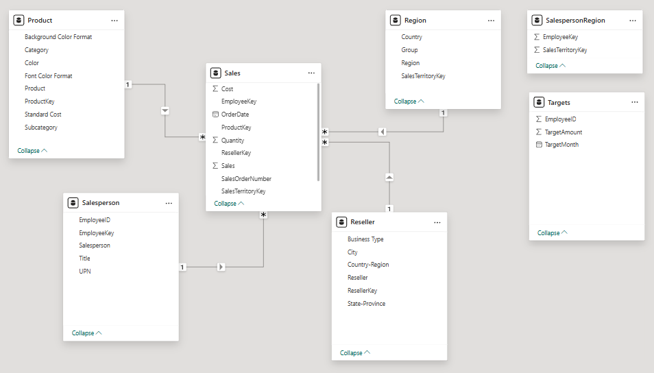
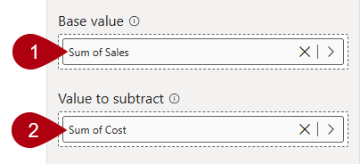

---
lab:
  title: Configurar um modelo semântico no Power BI
  module: Configure a semantic model in Power BI
---

# Configurar um modelo semântico no Power BI

## História do laboratório

Neste laboratório, você começará a desenvolver o modelo de dados. Ele envolverá a criação de relações entre tabelas e, em seguida, a configuração de propriedades de tabela e de coluna a fim de melhorar a usabilidade do modelo de dados e torná-lo mais amigável. Você também criará hierarquias e criará medidas rápidas.

Neste laboratório, você aprenderá a:

- Criar relações de modelo.
- Configure propriedades de tabela e de coluna.
- Criar hierarquias.
- Criar medidas rápidas.
- Configurar uma relação muitos para muitos.

**Este laboratório levará aproximadamente 45 minutos.**

## Introdução

Para concluir este exercício, primeiro abra um navegador da Web e insira a seguinte URL para baixar o arquivo zip:

`https://github.com/MicrosoftLearning/PL-300-Microsoft-Power-BI-Data-Analyst/raw/Main/Allfiles/Labs/03-configure-semantic-model/03-model-data.zip`

Extraia o arquivo para a pasta **C:\Users\Student\Downloads\03-model-data**.

Abra o arquivo **03-Starter-Sales Analysis.pbix**.

> _**Observação**: Você pode ver uma caixa de diálogo de entrada enquanto o arquivo é carregado. Selecione **Cancelar** para ignorar a caixa de diálogo de entrada. Feche todas as janelas informativas. Caso precise aplicar as alterações, clique em **Aplicar depois**._

## Criar relações de modelo

Nesta tarefa, você criará relações de modelo. O arquivo foi configurado para não identificar relações entre tabelas, que não é a configuração padrão, mas é recomendado para evitar trabalho extra criando as relações corretas para seu modelo.

> Os laboratórios usam uma notação abreviada para referenciar um campo. Ela é parecida com esta: `Product | Category`. Neste exemplo, `Product` é o nome da tabela e `Category` é o nome do campo.

1. No Power BI Desktop, para exibir todos os campos de tabela, no painel **Data**, clique com o botão direito do mouse em uma área vazia e, em seguida, selecione **Expandir Tudo**.

1. Para criar um visual de tabela, no painel **Data**, dentro da tabela `Product`, marque o campo `Category`.

1. Para adicionar uma coluna à tabela, no painel **Data**, marque o campo `Sales | Sales`.

1. Observe que o visual de tabela lista quatro categorias de produto e que o valor das vendas é o mesmo para cada uma delas e o mesmo para o total.

    

    > _O problema é que a tabela se baseia em campos de tabelas diferentes. A expectativa é que cada categoria de produto exiba as vendas dessa mesma categoria. No entanto, como não há uma relação de modelo entre essas tabelas, a tabela `Sales` não é filtrada. Agora, você adicionará uma relação para propagar filtros entre as tabelas._

1. Para alternar para o designer de modelo, à esquerda, selecione o ícone de **modo de exibição Modelo**.

    

1. Na faixa de opções **Início**, selecione **Gerenciar Relações**.

    

1. Na janela **Gerenciar Relações**, observe que nenhuma relação está definida ainda.

1. Para criar uma relação, selecione **+ Nova relação**.

1. Para configurar uma relação de tabela `Product` para tabela `Sales`, na lista suspensa **Da tabela**, selecione a tabela `Product` e, na lista suspensa **Para a tabela**, selecione a tabela `Sales`.

    

1. Observe que as seguintes propriedades foram configuradas automaticamente:

    - **As colunas ProductKey em cada tabela estão selecionadas**. _As colunas foram selecionadas porque compartilham o mesmo nome e tipo de dados. Talvez seja necessário encontrar colunas correspondentes com nomes diferentes em dados reais._
    - **O tipo de cardinalidade é Um para Muitos (1:\*)**). _A cardinalidade foi detectada automaticamente, porque o Power BI entende que a coluna `ProductKey` da tabela `Product` contém valores exclusivos. Relações um-para-muitos são a cardinalidade mais comum, e todas as relações que você criar neste laboratório serão desse tipo._
    - **O tipo de direção do filtro cruzado é única**. _A direção de filtro única significa que os filtros se propagam do "lado um" para o "lado muitos". Nesse caso, isso significa que os filtros aplicados à tabela `Product` serão propagados para a tabela `Sales`, mas não na outra direção._
    - **Confirme se a opção Tornar essa relação ativa está marcada**. _As relações ativas propagam filtros. É possível marcar uma relação como inativa para que os filtros não se propaguem. Relações inativas podem existir quando há vários caminhos de relação entre tabelas. Nesse caso, os cálculos de modelo podem usar funções especiais para ativá-las._

    

1. Selecione **Salvar**, observe na janela **Gerenciar Relações** a nova relação está listada e selecione **Fechar**.

1. No diagrama do modelo, observe que agora há um conector entre as duas tabelas (você pode optar por reposicionar as tabelas para ver a relação com mais clareza).

    

    > _Você pode interpretar muitas das propriedades de relação examinando a linha de relação no diagrama:_
    >
    > - _A cardinalidade é representada pelos indicadores **1** e **(\*)**._
    > - _A direção do filtro é representada pela ponta da seta._
    > - _Uma linha sólida representa uma relação ativa, enquanto uma linha pontilhada representa uma relação inativa._
    >
    > Dica: focalize o cursor sobre a relação para destacar as colunas relacionadas.

1. Mude para o **modo de exibição Relatório** e observe que o visual de tabela foi atualizado para exibir valores diferentes para cada categoria de produto.

    > _Os filtros aplicados à tabela `Product` agora se propagam para a tabela `Sales`._

    

## Criar relações adicionais

Há uma forma mais fácil de criar uma relação. No diagrama de modelo, é possível arrastar e soltar colunas para criar uma relação.

1. Para criar uma relação usando uma técnica diferente, alterne para o **modo de exibição Modelo**.

1. Na tabela `Reseller`, arraste a coluna `ResellerKey` para a coluna `ResellerKey` da tabela `Sales`.

    > _**Importante**: Em algum momento, talvez não seja possível arrastar uma coluna. Se essa situação surgir, selecione uma coluna diferente, depois selecione a coluna que você pretende arrastar novamente e tente outra vez. Verifique se você vê a nova relação adicionada ao diagrama._

    

1. Na janela **Nova relação**, examine a configuração e selecione **Salvar**.

1. Use a nova técnica para criar estas duas relações de modelo:

     - `Region | SalesTerritoryKey` em `Sales | SalesTerritoryKey`
     - `Salesperson | EmployeeKey` em `Sales | EmployeeKey`

1. No diagrama, organize as tabelas de modo que a tabela `Sales` seja posicionada no centro do diagrama e as tabelas relacionadas sejam organizadas sobre ela. Posicione as tabelas desconectadas ao lado.

    

1. Salve o arquivo do Power BI Desktop.

## Configurar a tabela do Produto

Nesta tarefa, você configurará a tabela `Product` com uma hierarquia e uma pasta de exibição.

1. Alterne para a exibição de **Modelo**.

1. No painel **Dados**, se necessário, expanda a tabela `Product` para revelar todos os campos.

1. Na tabela `Product`, clique com o botão direito do mouse na coluna `Category` e selecione **Criar hierarquia**.

    

1. No painel **Propriedades**, na caixa **Nome**, substitua o valor por _Produtos_.

    

1. Para adicionar níveis à hierarquia, na lista suspensa **Hierarquia**, selecione **Subcategoria** e selecione **Produto** e selecione **Aplicar Alterações de Nível**.

    

1. No painel **Data**, observe a hierarquia `Products`: Para revelar os níveis de hierarquia, expanda-os.

    

1. Para organizar as colunas em uma pasta de exibição, no painel **Data**, primeiro selecione a coluna `Background Color Format`.

1. Ao selecionar a tecla **CTRL**, selecione a coluna `Font Color Format`.

1. No painel **Propriedades**, na caixa **Pasta de Exibição**, digite _Formatting_.

    

1. No painel **Data**, observe que as duas colunas agora estão dentro de uma pasta.

    

    > _As pastas de exibição são uma ótima maneira de organizar tabelas, principalmente para tabelas que incluem muitos campos. Eles são apenas apresentação lógica._

## Configurar a tabela Região

Nesta tarefa, você configurará a tabela `Region` com uma hierarquia e categorias atualizadas.

1. Na tabela `Region`, crie uma hierarquia chamada _Regiões_, com estes três níveis:

     - `Group`
     - `Country`
     - `Region`

1. Selecione a coluna `Country` (não o nível de hierarquia `Country`).

1. No painel **Propriedades**, expanda a seção **Avançado** (localizada na parte inferior do painel) e, na lista suspensa **Categoria de Dados**, selecione **País/Região**.

    

    > _A categorização de dados pode fornecer dicas para o designer de relatórios. Nesse caso, categorizar a coluna como país ou região fornece informações mais precisas ao Power BI quando ele renderiza uma visualização de mapa._

## Configurar a tabela Revendedor

Nesta tarefa, você configurará a tabela `Reseller` para adicionar uma hierarquia e atualizar categorias de dados.

1. Na tabela `Reseller`, crie uma hierarquia chamada _Revendedores_, com estes dois níveis:

     - `Business Type`
     - `Reseller`

1. Crie uma segunda hierarquia denominada _Geography_, com estes quatro níveis:

     - `Country-Region`
     - `State-Province`
     - `City`
     - `Reseller`

1. Defina a categoria de dados para as seguintes colunas (não dentro da hierarquia):

    - `Country-Region` para **País/região**
    - `State-Province` para **Estado ou província**
    - `City` para **Cidade**

## Configurar a tabela Vendas

Nesta tarefa, você configurará a tabela `Sales` com descrições, formatação e resumo atualizados.

1. Na tabela `Sales`, selecione a coluna `Cost`.

1. No painel **Propriedades**, na caixa **Descrição**, digite: _Baseado no custo padrão_

    > _As descrições podem ser aplicadas a tabelas, colunas, hierarquias ou medidas. No painel **Data**, o texto de descrição é revelado em uma dica de ferramenta quando um autor de relatório passa o cursor sobre o campo._

1. Selecione a coluna `Quantity`.

1. No painel **Propriedades**, dentro da seção **Formatação**, defina a propriedade **Separador de Milhares** para _Sim_.

1. Selecione a coluna `Unit Price`.

1. No painel **Propriedades**, na seção **Formatação**, defina a propriedade **Casas Decimais** como _2_.

1. No grupo **Avançado** (talvez seja necessário rolar para baixo para localizá-lo), na lista suspensa **Resumir Por**, selecione **Média**.

    > _Por padrão, colunas numéricas serão resumidas somando valores em conjunto. Esse comportamento padrão não é adequado para uma coluna como `Unit Price`, que representa uma taxa. A definição do resumo padrão como média produzirá um resultado útil e preciso._

## Atualizar propriedades em massa

Nessa tarefa, você atualizará várias colunas em uma única atualização em massa. Você usará essa abordagem para ocultar colunas e formatar valores de coluna.

1. No painel **Data** (ou diagrama de modelo), selecione a coluna `Product | ProductKey`.

1. Ao pressionar a tecla **Ctrl**, selecione estas 13 colunas (abrangendo várias tabelas):

     - `Region | SalesTerritoryKey`
     - `Reseller | ResellerKey`
     - `Sales | EmployeeKey`
     - `Sales | ProductKey`
     - `Sales | ResellerKey`
     - `Sales | SalesOrderNumber`
     - `Sales | SalesTerritoryKey`
     - `Salesperson | EmployeeID`
     - `Salesperson | EmployeeKey`
     - `Salesperson | UPN`
     - `SalespersonRegion | EmployeeKey`
     - `SalespersonRegion | SalesTerritoryKey`
     - `Targets | EmployeeID`

1. No painel **Propriedades**, defina a propriedade **Está Oculto** como _Sim_.

    > _As colunas ficaram ocultas porque são usadas por relacionamentos ou serão usadas na configuração de segurança em nível de linha ou na lógica de cálculo._
    >
    > _Você usará a coluna `SalesOrderNumber` em um cálculo no laboratório **Criar cálculos DAX no Power BI Desktop**._

1. Faça uma seleção múltipla das três seguintes colunas:

     - `Product | Standard Cost`
     - `Sales | Cost`
     - `Sales | Sales`

1. No painel **Propriedades**, na seção **Formatação**, defina a propriedade **Casas Decimais** para _0_ (zero).

## Explorar a interface do modelo

Nesta tarefa, você alternará para **modelo de exibição Relatório**, examinará a interface do modelo de dados e configurará a data/hora automáticas.

1. Alterne para a exibição de **Relatório**.

1. No painel **Data**, observe o seguinte:

     - Colunas, hierarquias e os respectivos níveis são campos, que podem ser usados para configurar visuais de relatório.
     - Somente os campos relevantes para a criação de relatórios ficam visíveis.
     - A tabela `SalespersonRegion` não está visível porque todos os campos dela estão ocultos.
     - Os campos espaciais nas tabelas `Region` e `Reseller` são adornados com um ícone espacial.
     - Os campos com o símbolo sigma (Ʃ) serão resumidos por padrão.
     - Uma dica de ferramenta é exibida ao focalizar o cursor sobre o campo `Sales | Cost`.

1. Expanda o campo `Sales | OrderDate` e observe que ele revela um `Date Hierarchy`. O campo `Targets | TargetMonth` fornece uma hierarquia semelhante.

    

    > _**Importante**: Essas hierarquias não foram criadas por você. Elas foram criadas automaticamente como uma configuração padrão. No entanto, há um problema. O ano fiscal da Adventure Works começa em 1º de julho de cada ano. No entanto, nessas hierarquias criadas automaticamente, o ano da hierarquia de data começa em 1º de janeiro de cada ano._

1. Para desativar a configuração de data/hora automática, navegue até **Arquivo > Opções e Configurações > Opções**.

1. Na janela **Opções**, na seção **Arquivo Atual**, navegue até **Carga de Dados > Inteligência de Dados Temporais** e desmarque **Data/Hora Automática**.

    

1. No painel **Dados**, observe que as hierarquias de datas não estão mais disponíveis.

## Criar medidas rápidas

Nesta tarefa, você criará duas medidas rápidas para calcular a margem de lucro e o lucro. Uma medida rápida cria a fórmula do cálculo para você. Elas são fáceis e rápidas de serem criadas para cálculos simples e comuns.

1. No painel **Dados**, clique com o botão direito do mouse na tabela `Sales` e, em seguida, selecione **Nova Medida Rápida**.

    

1. No painel **Medidas Rápidas**, na lista suspensa **Selecionar um Cálculo** e dentro do grupo **Operações Matemáticas**, selecione **Subtração**.

    

1. No painel **Dados**, arraste o campo `Sales | Sales` para a caixa **Valor Base**.

    

1. Arraste o campo `Sales | Cost` para a caixa **Valor para Subtrair**.  

    

1. Selecione **Adicionar**.

1. No painel **Dados**, dentro da tabela `Sales`, observe a nova medida.

    > _As medidas são indicadas pelo ícone da calculadora._

    

1. Para renomear a medida, clique com o botão direito do mouse nela, selecione **Renomear** e renomeie-a como _Lucro_.

    > _Dica: para renomear um campo, você também pode clicar duas vezes nele ou selecioná-lo e pressionar **F2**._

1. Na tabela `Sales`, adicione uma segunda medida rápida, com base nos seguintes requisitos:

    > _**Importante**: se a opção de criar uma medida rápida não aparecer no menu de contexto, use o comando localizado na faixa de opções **Início**, de dentro do grupo **Cálculos**.

    - Use a operação matemática **Divisão**.
    - Defina o **Numerador** para o campo `Sales | Profit`.
    - Defina o **Denominador** para o campo `Sales | Sales`.
    - Renomear a medida como _Margem de lucro_.

1. Verifique se a medida `Profit Margin` está selecionada e, em seguida, na faixa de opções de contexto **Ferramentas de Medida**, defina o formato como **Percentual**, com duas casas decimais.

    

1. Para testar as duas medidas, primeiro selecione o visual de tabela existente na página.

1. No painel **Dados**, verifique as medidas `Profit` e `Profit Margin` para adicioná-las à tabela.

    

1. Selecione e arraste a guia correta para ampliar o visual de tabela.

    

1. Verifique se as medidas produzem resultados razoáveis e que estejam formatados corretamente.

    

## Criar um relacionamento muitos-para-muitos

Nesta tarefa, você criará uma relação muitos para muitos entre as tabelas `Salesperson` e `Sales`.

1. No **modo de exibição Relatório**, selecione uma área em branco da página do relatório.

1. Para criar um visual de tabela, no painel **Dados**, marque os dois campos a seguir:

     - `Salesperson | Salesperson`
     - `Sales | Sales`

    

    > _O visual de tabela exibe as vendas feitas por vendedor. No entanto, há outra relação entre vendedores e vendas. Alguns vendedores pertencem a uma, duas ou possivelmente mais regiões de vendas. Além disso, vários vendedores podem ser atribuídos a cada região de vendas._
    >
    > _Do ponto de vista do gerenciamento de desempenho, as vendas de um vendedor (com base nas regiões às quais ele é atribuído) precisam ser analisadas e comparadas com metas de vendas. No próximo exercício, você criará relações para dar suporte a essa análise._

1. Observe que _Michael Blythe_ gerou quase 9 milhões de dólares em vendas.

1. Alterne para o **modo de exibição Modelo** e arraste a tabela `SalespersonRegion` para posicioná-la entre as tabelas `Region` e `Salesperson`.

1. Use a técnica de arrastar e soltar para criar estas duas relações de modelo:

    - `Salesperson | EmployeeKey` em `SalespersonRegion | EmployeeKey`
    - `Region | SalesTerritoryKey` em `SalespersonRegion | SalesTerritoryKey`

    > _A tabela `SalespersonRegion` pode ser considerada uma tabela de ponte._

1. Alterne para o **modo de exibição Relatório** e observe que o visual não foi atualizado: o resultado de vendas para Michael Blythe não foi alterado.

1. Volte para o **modo de exibição Modelo** e, partindo da tabela `Salesperson`, siga as direções de filtro de relação (ponta de seta).

    > _Considere que a tabela `Salesperson` filtra a tabela `Sales`. Ele também filtra a tabela `SalespersonRegion`, mas não continua propagando filtros para a tabela `Region` (a ponta de direção está apontando para a direção errada)._

    

1. Para editar a relação entre as tabelas `Region` e `SalespersonRegion`, clique duas vezes na relação.

1. Na janela **Editar Relação**, na lista suspensa **Direção do filtro cruzado**, selecione _Ambas_.

1. Marque a caixa de seleção **Aplicar filtro de segurança em ambos os sentidos**.

    

1. Selecione **Salvar**.

1. Observe que a relação agora tem uma ponta de seta dupla.

    

1. Alterne para o **modo de exibição Relatório** e observe que os valores de vendas ainda não foram alterados.

    > _O problema agora está relacionado ao fato de que há dois caminhos possíveis de propagação de filtros entre as tabelas `Salesperson` e `Sales`. Essa ambiguidade é resolvida internamente, com base em uma avaliação do "número mínimo de tabelas". para que fique claro, você não deve criar modelos com esse tipo de ambiguidade – problema será resolvido em uma parte posterior deste laboratório, após a conclusão do laboratório **Criar cálculos DAX no Power BI Desktop**._

1. Alterne para a exibição de **Modelo**.

1. Para forçar a propagação do filtro por meio da tabela de ponte, edite (clique duas vezes) na relação entre as tabelas `Salesperson` e `Sales`.

1. Na janela **Editar Relação**, desmarque a caixa de seleção **Tornar Esta Relação Ativa**.

    

1. Selecione **Salvar**.

    > _A propagação do filtro agora segue o único caminho ativo._

1. No diagrama do modelo, observe que a relação inativa é representada por uma linha pontilhada.

    

1. Alterne para o **modo de exibição Relatório** e observe que as vendas de Michael Blythe agora são de quase US$ 22 milhões.

1. Observe também que as vendas de cada vendedor, se adicionadas, excederão o total da tabela.

     > _Essa é uma observação de uma relação muitos para muitos, devido à contagem dupla, tripla etc. de resultados de vendas regionais. Considere o caso de Davi Barros, o segundo vendedor listado. O valor de vendas dele é igual ao valor de vendas total. Esse é o resultado correto, porque ele é o diretor de vendas; as vendas dele são medidas pelas vendas de todas as regiões._
     >
     > _Embora a relação muitos para muitos esteja funcionando agora, ainda não é possível analisar as vendas feitas por um vendedor (porque a relação está inativa). Você poderá reativar a relação quando introduzir uma tabela calculada que permitirá analisar as vendas feitas nas regiões de vendas atribuídas ao vendedor (para análise de desempenho) no laboratório **Criar cálculos DAX no Power BI Desktop**._

1. Alterne para o **modo de exibição Modelo** e, no diagrama do modelo, selecione a tabela `Salesperson`.

1. No painel **Propriedades**, na caixa **Nome**, substitua o texto por _Vendedor (Desempenho)_.

    > _A tabela renomeada agora reflete a finalidade dela: ela é usada para relatar e analisar o desempenho de vendedores com base nas vendas das regiões de vendas atribuídas a eles._

## Criar uma relação com a tabela Metas

Nesta tarefa, você criará uma relação com a tabela `Targets`.

1. Crie uma relação a partir da coluna `Salesperson (Performance) | EmployeeID` e da coluna `Targets | EmployeeID`.

1. No **modo de exibição Relatório**, adicione o campo `Targets | Target` para o visual de tabela.

1. Redimensione o visual da tabela para que todas as colunas fiquem visíveis.

    

 > _Agora, é possível visualizar as vendas e as metas. Mas tome cuidado, por dois motivos. Primeiro, não há nenhum filtro de período e, portanto, as metas também incluem valores futuros de meta. Segundo, as metas não são aditivas, portanto, o total não deve ser exibido. Elas podem ser desabilitadas formatando o visual ou removidas usando a lógica de cálculo._

1. Salve o arquivo do Power BI Desktop.

## Laboratório concluído

Você pode optar por salvar seu relatório do Power BI, embora isso não seja necessário para este laboratório. No próximo exercício, você trabalhará com um arquivo inicial pré-criado.

1. Navegue até o menu **"Arquivo"** no canto superior esquerdo e selecione **"Salvar como"**. 
1. Selecione **Procurar neste dispositivo**.
1. Selecione a pasta na qual você deseja salvar o arquivo e dê a ele um nome descritivo. 
1. Selecione o botão **Salvar** para salvar o relatório como um arquivo .pbix. 
1. Se for exibida uma caixa de diálogo solicitando a aplicação das alterações de consulta pendentes, selecione **Aplicar**.
1. Feche o Power BI Desktop.