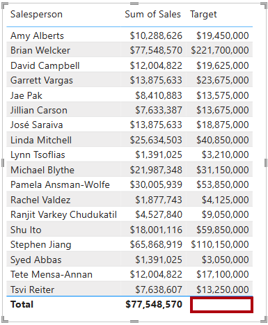

---
lab:
  title: Criar cálculos DAX em modelos semânticos
  module: Create DAX calculations in semantic models
---

# Criar cálculos DAX em modelos semânticos

## História do laboratório

Neste laboratório, você criará tabelas e colunas calculadas, além de medidas simples usando o DAX (Data Analysis Expressions).

Neste laboratório, você aprenderá a:

- Criar tabelas calculadas.
- Criar colunas calculadas.
- Criar medidas.

**Este laboratório levará aproximadamente 45 minutos.**

## Introdução

Para concluir este exercício, primeiro abra um navegador da Web e insira a seguinte URL para baixar o arquivo zip:

`https://github.com/MicrosoftLearning/PL-300-Microsoft-Power-BI-Data-Analyst/raw/Main/Allfiles/Labs/04-create-dax-calculations\04-dax-calculations.zip`

Extraia o arquivo para a pasta **C:\Users\Student\Downloads\04-dax-calculations**.

Abra o arquivo **04-Starter-Sales Analysis.pbix**.

> _**Observação**: Você pode ver uma caixa de diálogo de entrada enquanto o arquivo é carregado. Selecione **Cancelar** para ignorar a caixa de diálogo de entrada. Feche todas as janelas informativas. Caso precise aplicar as alterações, clique em **Aplicar depois**._

## Criar a tabela calculada Vendedor

Nesta tarefa, você criará a tabela calculada `Salesperson` (que terá uma relação direta com a tabela `Sales`).

Uma tabela calculada é criada inserindo primeiro o nome da tabela, seguido pelo símbolo de igual (=), seguido por uma fórmula DAX que retorna uma tabela. O nome da tabela não pode existir no modelo de dados.

Insira uma fórmula DAX válida na _barra de fórmulas_. A barra de fórmulas inclui recursos como preenchimento automático, Intellisense e codificação de cores, que permitem que você insira a fórmula de forma rápida e precisa.

1. No Power BI Desktop, no **modo de exibição Relatório**, na faixa de opções **Modelagem**, de dentro do grupo **Cálculos** selecione **Nova Tabela**.

    

1. Na barra de fórmulas (que é aberta diretamente abaixo da faixa de opções ao criar ou editar cálculos), digite `Salesperson =`, pressione **Shift+Enter**, digite `'Salesperson (Performance)'` e pressione **Enter**.

    > _**Observação**: para sua conveniência, todas as definições DAX neste laboratório podem ser copiadas do arquivo snippets, localizado no **04-dax-calculations\Snippets.txt**._

    

    > _Esta definição de tabela cria uma cópia da tabela `Salesperson (Performance)`. Ela copia somente os dados, no entanto, propriedades do modelo como visibilidade, formatação etc. não são copiadas._

1. No painel **Dados**, observe que o ícone de nova tabela tem um ícone de calculadora adicional na frente dele (indicando uma tabela calculada).

    

    > _**Observação**: As tabelas calculadas são definidas usando uma fórmula DAX que retorna uma tabela. É importante entender que as tabelas calculadas aumentam o tamanho do modelo de dados, pois materializam e armazenam valores. Além disso, elas são recalculadas sempre que as dependências de fórmulas são atualizadas, como será o caso neste modelo de dados, quando novos (futuros) valores de data forem carregados nas tabelas._
    >
    > _Ao contrário das tabelas provenientes do Power Query, as tabelas calculadas não podem ser usadas para carregar dados de fontes de dados externas. Elas só podem transformar dados com base no que já foi carregado no modelo de dados._

1. Alterne para o **modo de exibição Modelo** e observe que a tabela `Salesperson` está disponível.

1. Crie uma relação a partir da coluna `Salesperson | EmployeeKey` para a coluna `Sales | EmployeeKey`.

    > _Os laboratórios usam uma notação abreviada para referenciar um campo. Ele terá a seguinte aparência:`Salesperson | EmployeeKey`. Neste exemplo, `Salesperson` é o nome da tabela e `EmployeeKey` é o nome da coluna._

1. Clique com o botão direito do mouse no relacionamento inativo entre as tabelas `Salesperson (Performance)` e `Sales` (linha pontilhada) e selecione **Excluir**. Quando precisar confirmar a exclusão, selecione **Sim**.

1. Na tabela `Salesperson`, faça a multisseleção das seguintes colunas e oculte-as (defina a propriedade **Está oculto** como _Sim_):

    - `EmployeeID`
    - `EmployeeKey`
    - `UPN`

1. No diagrama do modelo, selecione a tabela `Salesperson`.

1. No painel **Propriedades**, na caixa **Descrição**, digite: _Vendedor relacionado às vendas_

    > _Lembre-se de que descrições aparecem como dicas de ferramentas no painel **Dados** quando o usuário passa o cursor sobre uma tabela ou um campo._

1. Para a tabela `Salesperson (Performance)`, defina a descrição como: _Vendedor relacionado às regiões_

> _Agora o modelo de dados fornece duas alternativas durante a análise de vendedores. A tabela `Salesperson` permite analisar as vendas feitas por um vendedor, enquanto a tabela `Salesperson (Performance)` permite analisar as vendas realizadas nas regiões de vendas atribuídas ao vendedor._

## Criar a tabela Dados

Nesta tarefa, você criará a tabela `Date`.

1. Alternar para a **modo de exibição Tabela**. Na guia de faixa de opções **Página Inicial**, no grupo **Cálculos**, selecione **Nova Tabela**.

    

1. Na barra de fórmulas, insira este DAX:

    ```dax
    Date =  
    CALENDARAUTO(6)
    ```

    

    > _A função `CALENDARAUTO` retorna uma tabela de coluna única que inclui valores de data. O comportamento "automático" examina todas as colunas de data do modelo de dados para determinar os valores de data mais antigos e mais recentes armazenados no modelo de dados. Em seguida, cria uma linha para cada data dentro desse intervalo, estendendo o intervalo em qualquer direção para garantir o armazenamento de anos completos de dados._
    >
    > _Essa função pode usar um único argumento opcional que é o último número de mês de um ano. Quando omitido, o valor é 12, o que significa que dezembro é o último mês do ano. Neste caso, 6 é inserido, o que significa que junho é o último mês do ano._

1. Observe a columa de valores de data, que podem ser formatadas com as configurações regionais dos EUA (ou seja, mm/dd/aaaa).

    

1. No canto inferior esquerdo, na barra de status, observe as estatísticas de tabela, confirmando que foram geradas 1826 linhas de dados, o que representa cinco anos completos de dados.

    

## Criar colunas calculadas

Nesta tarefa, você adicionará mais colunas para habilitar a filtragem e o agrupamento por períodos diferentes. Você também criará uma coluna calculada para controlar a ordem de classificação de outras colunas.

> _**Observação**: para sua conveniência, todas as definições DAX neste laboratório podem ser copiadas do arquivo **Snippets.txt**._

1. Na faixa de opções contextual **Ferramentas de Tabela**, no grupo **Cálculos**, selecione **Nova Coluna**.

    > _Uma coluna calculada é criada inserindo primeiro o nome da coluna, seguido pelo símbolo de igual (=), seguido por uma fórmula DAX que retorna um resultado de valor único. O nome da coluna não pode já existir na tabela._

    

1. Na barra de fórmulas, digite o seguinte (ou copie do arquivo de snippets) e pressione **Enter**:

    > _A fórmula usa o valor de ano da data, mas adiciona um ao valor de ano quando o mês é posterior a junho. É assim que são calculados os anos fiscais do Adventure Works._

   ```dax
   Year =
   "FY" & YEAR('Date'[Date]) + IF(MONTH('Date'[Date]) > 6, 1)
   ```

1. Use as definições de arquivo de snippets para criar estas duas colunas calculadas para a tabela `Date`:

    - `Quarter`
    - `Month`

1. Verifique se as novas colunas foram adicionadas.

    

1. Para validar os cálculos, alterne para o **modo de exibição Relatório**.

1. Para criar uma nova página de relatório, selecione o ícone de adição ao lado da **Página 1**.

    

1. Para adicionar um visual da matriz à nova página de relatório, no painel **Visualizações**, selecione o tipo de visual da matriz.

    > _Dicas: você pode passar o cursor sobre cada ícone para revelar uma dica de ferramenta que descreve o tipo de visual._

    

1. No painel **Dados**, dentro da tabela `Date`, arraste o campo `Year` para a caixa **Linhas**.

    

1. Arraste o campo `Month` até a caixa **Linhas**, diretamente abaixo do campo `Year`.

1. No canto superior direito do visual da matriz (ou inferior, dependendo da localização do visual), selecione o ícone de seta bifurcada (que expandirá todos os anos para baixo um nível).

    

1. Observe que os anos se expandem para meses e que os meses são classificados em ordem alfabética, em vez de cronologicamente.

    

    > _Por padrão, os valores de texto são classificados em ordem alfabética, os números são classificados do menor para o maior, e as datas são classificadas da mais antiga para a mais recente._

1. Para personalizar a ordem de classificação do campo `Month`, alterne para o **modo de exibição Tabela**.

1. Adicione a coluna `MonthKey` à tabela `Date`.

    ```dax
    MonthKey =
    (YEAR('Date'[Date]) * 100) + MONTH('Date'[Date])
    ```

    > _Essa fórmula calcula um valor numérico para cada combinação de ano/mês._

1. No **modo de exibição Tabela**, verifique se a nova coluna contém valores numéricos (por exemplo, 201707 para julho de 2017 e assim por diante).

    

1. Alterne novamente para o **modo de exibição Relatório**.

1. No painel **Dados** e selecione o campo `Month`.

1. Na faixa de opções contextual **Ferramentas de Coluna**, no grupo **Classificar**, selecione **Classificar por Coluna** e escolha **MonthKey**.

    

1. No visual da matriz, observe que os meses agora estão classificados cronologicamente.

    

## Concluir a tabela Data

Nesta tarefa, você concluirá o design da tabela `Date` ocultando uma coluna e criando uma hierarquia. Em seguida, você criará relacionamentos para as tabelas `Sales` e `Targets`.

1. Alterne para a exibição de **Modelo**.

1. Na tabela `Date`, oculte a coluna `MonthKey` (defina **Está Oculto** como _Sim_).

1. No painel **Dados**, selecione a tabela `Date`, clique com o botão direito do mouse na coluna `Year` e selecione **Criar hierarquia**.

    

1. No painel **Propriedades**, na caixa **Nome**, substitua o valor por _Fiscal_.

    

1. Para adicionar níveis à hierarquia, na lista suspensa **Hierarquia**, selecione **Trimestre** e selecione **Mês** e selecione **Aplicar Alterações de Nível**.

    

1. Crie estas duas relações de modelo:

    - `Date | Date` em `Sales | OrderDate`
    - `Date | Date` em `Targets | TargetMonth`

1. Oculte estas duas colunas:

    - `Sales | OrderDate`
    - `Targets | TargetMonth`

## Marcar a tabela Data

Nesta tarefa, você marcará a tabela `Date` como uma tabela de data.

1. Alterne para a exibição de **Relatório**.

1. No painel **Dados**, selecione a tabela `Date` (não o campo `Date`).

1. Na faixa de opções contextual **Ferramentas de Tabela**, dentro do grupo **Calendários**, clique em **Marcar como Tabela de Data**.

    

1. Na janela **Marcar como Tabela de Data**, deslize a propriedade **Marcar como Tabela de Data** para _Sim_.

1. Na lista suspensa **Escolher uma coluna de data**, selecione **Data**.

    

1. Selecione **Salvar**.

1. Salve o arquivo do Power BI Desktop.

> _O Power BI Desktop agora entende que essa tabela define a data (hora)._
>
> _Essa abordagem de design para uma tabela de data é adequada quando você não tem uma tabela de data em sua fonte de dados. Caso você um data warehouse, seria apropriado carregar dados de data da sua tabela de dimensões de data, em vez de "redefinir" a lógica de data em seu modelo de dados._

## Criar medidas simples

Nesta tarefa, você criará medidas simples. Medidas simples agregam valores em uma única coluna ou contam linhas de uma tabela.

1. No **modo de exibição Relatório**, na **Página 2** no painel **Dados**, arraste o campo `Sales | Unit Price` no visual de matriz.

    

1. No painel de campos de visuais (localizado abaixo do painel **Visualizações**), na caixa **Valores**, observe que o campo `Unit Price` está configurado como **Média do Preço Unitário**.

    

1. Escolha a seta para baixo de **Média do Preço Unitário** e observe as opções de menu disponíveis.

    > _As colunas numéricas visíveis permitem que os autores de relatório decidam no tempo de design como uma coluna será resumida (ou não). No entanto, isso pode resultar em relatórios inadequados._
    >
    > _Alguns modeladores de dados não gostam de deixar as coisas ao acaso e optam por ocultar essas colunas e expor a lógica de agregação definida por medidas. Essa é a abordagem que você executará agora neste laboratório._

1. Para criar uma medida, no painel **Dados**, clique com o botão direito do mouse na tabela `Sales` e selecione **Nova Medida**.

1. Na barra de fórmulas, adicione a seguinte definição de medida:

    ```DAX
    Avg Price =  
    AVERAGE(Sales[Unit Price])
    ```

1. Adicione a medida `Avg Price` ao visual de matriz e observe que ela produz o mesmo resultado que a coluna `Unit Price` (mas com formatação diferente).

1. Na caixa **Valores**, abra o menu de contexto do campo `Avg Price` e observe que não é possível alterar a técnica de agregação.

    

    > _Não é possível modificar o comportamento de agregação de uma medida._

1. Use as definições de arquivo de snippets para criar as cinco medidas a seguir para a tabela `Sales`:

    - `Median Price`
    - `Min Price`
    - `Max Price`
    - `Orders`
    - `Order Lines`

    > _A função `DISTINCTCOUNT` usada na medida `Orders` conta os pedidos apenas uma vez (ignorando duplicatas). A função `COUNTROWS` usada na medida `Order Lines` funciona em uma tabela._
    >
    > _Nesse caso, o número de pedidos é calculado contando os valores distintos da coluna `SalesOrderNumber`, enquanto o número de linhas do pedido é simplesmente o número de linhas da tabela (cada linha é uma linha de um pedido)._

1. Alterne para o **modo de exibição Modelo** e selecione as quatro medidas de preço: `Avg Price`, `Max Price`, `Median Price` e `Min Price`.

1. Para a seleção de várias medidas, configure os seguintes requisitos:

    - Definir o formato para duas casas decimais.
    - Atribua a uma pasta de exibição chamada _Preços_ (use a propriedade da **Pasta de exibição** no painel **Propriedades**).

    

1. Oculte a coluna `Unit Price`.

    > _A coluna `Unit Price` não está mais disponível para autores de relatório. Eles devem usar as medidas de preço que você adicionou ao modelo. Essa abordagem de design garante que os autores de relatório não agreguem preços de forma inadequada, por exemplo, somando-os._

1. Faça a seleção múltipla das medidas `Order Lines` e `Orders` e configure os seguintes requisitos:

    - Defina o formato para usar o separador de milhar.
    - Atribuir a uma pasta de exibição chamada _Contagens_.

    

1. No **modo de exibição Relatório**, na caixa **Valores** do visual de matriz, para **Média do Preço Unitário**, selecione **X** para removê-lo.

    

1. Aumente o tamanho do visual da matriz para preencher a largura e a altura da página.

1. Adicione estas cinco medidas ao visual da matriz:

    - `Median Price`
    - `Min Price`
    - `Max Price`
    - `Orders`
    - `Order Lines`

1. Verifique se os resultados parecem razoáveis e se estão formatados corretamente.

    

## Criar medidas adicionais

Nesta tarefa, você criará mais medidas que usam fórmulas mais complexas.

1. No **modo de exibição Relatório**, selecione **Página 1** e examine o visual da tabela de vendedores (à direita), observando o total da coluna **Soma de Destino**.

    

1. Selecione o visual de tabela e, no painel **Visualizações**, remova **Soma de Destino**.

1. Renomeie a coluna `Targets | Target` como _TargetAmount_.

    > _Dica: Há várias maneiras de renomear a coluna no **modo de exibição Relatório**: No painel **Dados**, você pode clicar com o botão direito do mouse na coluna e, em seguida, selecionar **Renomear**, clicar duas vezes na coluna ou pressionar **F2**._

1. Crie a seguinte medida na tabela `Targets`:

    ```dax
    Target =
    IF(
        HASONEVALUE('Salesperson (Performance)'[Salesperson]),
        SUM(Targets[TargetAmount])
    )
    ```

    > _A função `HASONEVALUE` testa se é filtrado um único valor na coluna `Salesperson`. Se ela for true, a expressão retornará a soma dos valores de destino (apenas para esse vendedor). Quando false, `BLANK` é retornado._

1. Formate a medida de `Target` para zero casas decimais.

    > _Dica: você pode usar a faixa de opções contextual **Ferramentas de Medida**._

1. Oculte a coluna `TargetAmount`.

    > _Dica: clique com o botão direito do mouse na coluna no painel **Dados** e selecione **Ocultar**._

1. Observe que a tabela `Targets` agora aparece na parte superior da lista.

    

    > _As tabelas que compõem apenas as medidas visíveis são listadas automaticamente na parte superior da lista._

1. Adicione a nova medida `Target` ao visual da tabela.

1. Observe que o total da coluna **Destino** agora é `BLANK`.

    

1. Use as definições de arquivo de snippets para criar as duas medidas a seguir para a tabela `Targets`:

    - `Variance`
    - `Variance Margin`

1. Formate a medida de `Variance` para zero casas decimais.

1. Formate a medida `Variance Margin` como um percentual com duas casas decimais.

1. Adicione as novas medidas `Variance` e `Variance Margin` ao visual da tabela.

1. Redimensione o visual de tabela para que todas as colunas e linhas possam ser exibidas.

    

    > _Embora pareça que todos os vendedores não estão atingindo o destino, lembre-se de que o visual de tabela ainda não foi filtrado por um período específico. Você produzirá relatórios de desempenho de vendas que usam a filtragem por um período selecionado pelo usuário no laboratório **Criar um relatório no Power BI Desktop**._

1. Salve o arquivo do Power BI Desktop.

## Laboratório concluído

Você pode optar por salvar seu relatório do Power BI, embora isso não seja necessário para este laboratório. No próximo exercício, você trabalhará com um arquivo inicial pré-criado.

1. Navegue até o menu **"Arquivo"** no canto superior esquerdo e selecione **"Salvar como"**. 
1. Selecione **Procurar neste dispositivo**.
1. Selecione a pasta na qual você deseja salvar o arquivo e dê a ele um nome descritivo. 
1. Selecione o botão **Salvar** para salvar o relatório como um arquivo .pbix. 
1. Se for exibida uma caixa de diálogo solicitando a aplicação das alterações de consulta pendentes, selecione **Aplicar**.
1. Feche o Power BI Desktop.