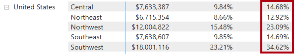

---
lab:
  title: Modificar o contexto de filtro do DAX no Power BI
  module: Modify DAX filter context in Power BI
---

# Modificar o contexto de filtro do DAX no Power BI

## História do laboratório

Neste laboratório, você criará medidas com expressões DAX que envolvem manipulação de contexto de filtro.

Você aprenderá como:

 - Usar a função `CALCULATE` para manipular o contexto do filtro.

**Este laboratório levará aproximadamente 30 minutos.**

## Introdução

Para concluir este exercício, primeiro abra um navegador da Web e insira a seguinte URL para baixar o arquivo zip:

`https://github.com/MicrosoftLearning/PL-300-Microsoft-Power-BI-Data-Analyst/raw/Main/Allfiles/Labs/05-modify-dax-filter-context/05-modify-dax-filter-context.zip`

Extraia o arquivo para a pasta **C:\Users\Student\Downloads\05-modify-dax-filter-context**.

Abra o arquivo **05-Starter-Sales Analysis.pbix**.

> _**Observação**: Você pode ver uma caixa de diálogo de entrada enquanto o arquivo é carregado. Selecione **Cancelar** para ignorar a caixa de diálogo de entrada. Feche todas as janelas informativas. Caso precise aplicar as alterações, clique em **Aplicar depois**._

## Criar um visual de matriz

Nesta tarefa, você criará um visual de matriz para testar suas novas medidas.

1. No Power BI Desktop, crie uma página de relatório.

1. Na **Página 3**, adicione um visual de matriz.

    

1. Redimensione o visual da matriz de modo a preencher a página inteira.

1. Para configurar os campos de visuais da matriz, no painel **Data**, arraste a hierarquia `Region | Regions` e solte-a dentro do visual.

    > Os laboratórios usam uma notação abreviada para referenciar um campo ou uma hierarquia. Ela é parecida com esta: `Region | Regions`. Neste exemplo, `Region` é o nome da tabela e `Regions` é o nome da hierarquia.

1. Adicione o campo `Sales | Sales` à caixa **Valores**.

1. Para expandir toda a hierarquia, no canto superior direito do visual de matriz, selecione o ícone de seta bifurcada duas vezes.

    

1. Para formatar o visual, no painel **Visualizações**, selecione o painel **Formatar**.

    

1. Na caixa **Pesquisar**, digite _Layout_.

1. Defina a propriedade **Layout** como _Tabular_.

    

1. Verifique se o visual da matriz agora tem quatro cabeçalhos de coluna.

    

    > _Na Adventure Works, as regiões de vendas são organizadas em grupos, países e regiões. Todos os países, exceto os Estados Unidos, têm apenas uma região, que recebe o mesmo nome do país. Como os Estados Unidos são um grande território de vendas, ele é dividido em cinco regiões de vendas._

Você criará várias medidas neste exercício, depois as testará adicionando-as ao visual da matriz.

## Manipular o contexto de filtro

Nesta tarefa, você criará várias medidas com expressões DAX que usam a função `CALCULATE` para manipular o contexto de filtro.

> _A função `CALCULATE` é uma função poderosa usada para manipular o contexto do filtro. O primeiro argumento usa uma expressão ou medida (uma medida é apenas uma expressão nomeada). Os argumentos subsequentes permitem modificar o contexto do filtro._

1. Adicione uma medida à tabela `Sales`, com base na seguinte expressão:

    > _**Observação**: para sua conveniência, todas as definições de DAX neste laboratório podem ser copiadas do arquivo **C:\Users\Student\Downloads\05-modify-dax-filter-context\Snippets.txt**._

    ```dax
    Sales All Region =
    CALCULATE(
        SUM(Sales[Sales]),
        REMOVEFILTERS(Region)
    )
    ```

    > _A função `REMOVEFILTERS` remove os filtros ativos. Ela pode não remover nenhum argumento ou usar uma tabela, uma coluna ou várias colunas como seu argumento._
    >
    > _Nesta fórmula, a medida avalia a soma da coluna `Sales` em um contexto de filtro modificado, que remove todos os filtros aplicados às colunas da tabela `Region`._

1. Adicione a nova medida `Sales All Region` ao visual da matriz.

    

1. Observe que a medida calcula o total de vendas de todas as regiões por região, país (subtotal) e grupo (subtotal).

    > _A nova medida ainda não entregou um resultado útil. Quando as vendas de um grupo, país ou região são divididas por esse valor, é gerada uma taxa útil conhecida como "porcentagem do total geral"._

1. No painel **Data**, verifique se a medida `Sales All Region` está selecionada (quando selecionada, ela tem uma tela de fundo cinza-escuro) e, na barra de fórmulas, substitua o nome da medida e a fórmula pela seguinte fórmula:

    > _Dica: para substituir a fórmula existente, primeiro copie o trecho. Em seguida, selecione dentro da barra de fórmulas e pressione **Ctrl+A** para selecionar todo o texto. Em seguida, pressione **Ctrl+V** para colar o trecho para substituir o texto selecionado. Em seguida, pressione **Enter**._

    ```dax
    Sales % All Region =
    DIVIDE(
        SUM(Sales[Sales]),
        CALCULATE(
            SUM(Sales[Sales]),
            REMOVEFILTERS(Region)
        )
    )
    ```

    > _A medida foi renomeada para refletir com precisão a fórmula atualizada. A função `DIVIDE` divide a soma da coluna `Sales` (não modificada pelo contexto de filtro) pela soma da coluna `Sales` em um contexto modificado que remove todos os filtros aplicados à tabela `Region`._

1. No visual da matriz, observe que a medida foi renomeada e que um valor diferente agora aparece para cada grupo, país e região.

1. Formate a medida `Sales % All Region` como um percentual com duas casas decimais.

1. No visual da matriz, revise os valores da medida `Sales % All Region`.

    

1. Adicione outra medida à tabela `Sales`, com base na seguinte expressão, e formate-a como uma porcentagem:

    ```dax
    Sales % Country =
    DIVIDE(
        SUM(Sales[Sales]),
        CALCULATE(
            SUM(Sales[Sales]),
            REMOVEFILTERS(Region[Region])
        )
    )
    ```

1. Observe que a fórmula da medida `Sales % Country` difere ligeiramente da fórmula da medida `Sales % All Region`.

    > _A diferença é que o denominador modifica o contexto de filtro removendo os filtros na coluna `Region` da tabela `Region`, não todas as colunas da tabela `Region`. Isso significa que todos os filtros aplicados às colunas grupo ou país são preservados. Isso gera um resultado que representa as vendas como um percentual do país._

1. Adicione a nova medida `Sales % Country` ao visual da matriz.

1. Observe que apenas as regiões dos Estados Unidos produzem um valor que não é 100%.

    

    > _Lembre-se de que somente os Estados Unidos têm várias regiões. Todos os outros países têm uma única região, o que explica porque todos eles têm 100%._

1. Para melhorar a legibilidade dessa medida no visual, substitua a medida `Sales % Country` por esta fórmula aprimorada.

    ```dax
    Sales % Country =
    IF(
        ISINSCOPE(Region[Region]),
        DIVIDE(
            SUM(Sales[Sales]),
            CALCULATE(
                SUM(Sales[Sales]),
                REMOVEFILTERS(Region[Region])
            )
        )
    )
    ```

    > _A função `IF` usa a função `ISINSCOPE` para testar se a coluna de região é o nível em uma hierarquia de níveis. Quando ela tem o valor true, a função `DIVIDE` é avaliada. Quando false, `BLANK` é retornado porque a coluna de região não está no escopo._

1. Observe que a medida `Sales % Country` agora retorna um valor apenas quando a região está no escopo.

    

1. Adicione outra medida à tabela `Sales`, com base na seguinte expressão, e formate-a como uma porcentagem:

    ```dax
    Sales % Group =
    DIVIDE(
        SUM(Sales[Sales]),
        CALCULATE(
            SUM(Sales[Sales]),
            REMOVEFILTERS(
                Region[Region],
                Region[Country]
            )
        )
    )
    ```

    > _Para alcançar vendas como uma porcentagem de grupo, dois filtros podem ser aplicados para remover de maneira eficiente os filtros em duas colunas._

1. Adicione a nova medida `Sales % Group` ao visual da matriz.

1. Para melhorar a legibilidade dessa medida no visual, substitua a medida `Sales % Group` por esta fórmula.

    ```dax
    Sales % Group =
    IF(
        ISINSCOPE(Region[Region])
            || ISINSCOPE(Region[Country]),
        DIVIDE(
            SUM(Sales[Sales]),
            CALCULATE(
                SUM(Sales[Sales]),
                REMOVEFILTERS(
                    Region[Region],
                    Region[Country]
                )
            )
        )
    )
    ```

1. Observe que a medida `Sales % Group` agora retorna um valor apenas quando a região ou o país estão no escopo.

1. No **modo de exibição Modelo**, coloque as três novas medidas em uma pasta de exibição nomeada _Proporções_.

    

1. Salve o arquivo do Power BI Desktop.

> _As medidas adicionadas à tabela `Sales` modificaram o contexto de filtro para gerar uma navegação hierárquica. Observe que o padrão para alcançar o cálculo de um subtotal requer a remoção de algumas colunas do contexto de filtro e, para chegar no total geral, todas as colunas devem ser removidas._

## Laboratório concluído

Você pode optar por salvar seu relatório do Power BI, embora isso não seja necessário para este laboratório. No próximo exercício, você trabalhará com um arquivo inicial pré-criado.

1. Navegue até o menu **"Arquivo"** no canto superior esquerdo e selecione **"Salvar como"**. 
1. Selecione **Procurar neste dispositivo**.
1. Selecione a pasta na qual você deseja salvar o arquivo e dê a ele um nome descritivo. 
1. Selecione o botão **Salvar** para salvar o relatório como um arquivo .pbix. 
1. Se for exibida uma caixa de diálogo solicitando a aplicação das alterações de consulta pendentes, selecione **Aplicar**.
1. Feche o Power BI Desktop.