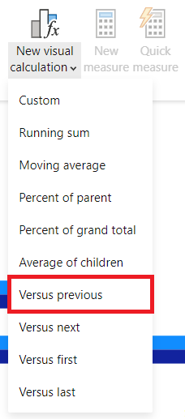

---
lab:
  title: Criar cálculos visuais no Power BI Desktop
  module: Create Visual Calculations in Power BI Desktop
---

# Criar cálculos visuais no Power BI Desktop

## **História do laboratório**

Neste laboratório, você criará cálculos visuais usando o DAX (Data Analysis Expressions). 

Neste laboratório, você aprenderá a:

- Criar e editar cálculos visuais
- Use as funções PREVIOUS(), RUNNINGSUM() e MOVINGAVERAGE() para criar métricas de comparação entre cada ano fiscal
- Use o parâmetro opcional Eixo ao criar métricas de comparação.
- Use o parâmetro opcional Redefinir para personalizar cálculos cumulativos em um eixo de vários níveis.

**Este laboratório levará aproximadamente 30 minutos.**

## Introdução

Para concluir este exercício, primeiro abra um navegador da Web e insira a seguinte URL para baixar a pasta zip:

`https://github.com/MicrosoftLearning/PL-300-Microsoft-Power-BI-Data-Analyst/raw/Main/Allfiles/Labs/05b-create-visual-calculations-in-power-bi-desktop/05b-visual-calculations.zip`

Extraia a pasta para a pasta **C:\Users\Student\Downloads\05b-visual-calculations**.

Abra o arquivo **05b-Starter-Sales Analysis.pbix**.

> ***Observação**: você pode ignorar a entrada clicando em **Cancelar**. Feche todas as janelas informativas. Caso precise aplicar as alterações, clique em **Aplicar depois**.*

No Power BI Desktop, acesse **Arquivo > Opções e Configurações > Opções > Visualizar recursos**. Selecione **Cálculos visuais** e clique em **OK**. Os cálculos visuais são habilitados depois que o Power BI Desktop é reiniciado.

## Criar um visual de gráfico de barras

Nesta tarefa, você criará um gráfico de barras que mostrará o valor das vendas, o custo total do produto e o lucro por ano fiscal, com métricas de comparação como dicas de ferramentas.

1. No painel **Visualizações**, selecione o tipo de visual Gráfico de barras clusterizado.

   

1. No painel **Dados**, de dentro da tabela **Data**, arraste o campo **Ano** na caixa/área **Eixo Y**.

1. Arraste os campos **Vendas** e **Custo** da tabela **Vendas** para a caixa/área **Eixo X**.

> Observe que, quando você adicionou Vendas e Custo ao visual, a soma de cada campo foi calculada automaticamente.

1. Classifique o gráfico de barras resultante por **Ano** crescente usando o menu de três pontos e selecionando **Ano** seguido de **Classificar por ordem crescente**:

   

> Agora você tem um gráfico de barras que mostra a Soma das Vendas e a Soma do Custo por Ano classificado cronologicamente.

### Adicionar cálculos

1. Com o gráfico de barras selecionado, selecione **Novo cálculo visual** na faixa de opções:

   

1. A janela de edição dos cálculos visuais será aberta. Na barra de fórmulas acima da matriz visual, insira a seguinte expressão e, em seguida, pressione Enter para confirmar o cálculo:

   ```DAX
   Profit = [Sum of Sales] – [Sum of Cost]
   ```

1. Confirme se agora você vê uma coluna Lucro na matriz visual na parte inferior da tela:

   

1. Expanda o menu em **Novo cálculo visual** e selecione **Versus o anterior** nas opções de modelo:

> **Versus o anterior** compara um valor com um valor anterior, portanto, vemos o Lucro em comparação com o valor anterior de Ano.

   

1. Na barra de fórmulas, substitua o espaço reservado `[Field]` por `[Profit]` duas vezes e confirme o cálculo.

1. Selecione **Soma acumulada** no menu de modelos, substitua o espaço reservado `[Field]` por `[Profit]` e confirme o cálculo.

> A **Soma acumulada** calcula a soma dos valores, adicionando o valor atual aos valores anteriores, para que vejamos o total do ano atual e anterior.

1. Selecione **Média móvel** no menu de modelos e substitua o espaço reservado `[Field]` por `[Profit]` e o espaço reservado `WindowSize` por 2. Você terá o seguinte conjunto:

> **Média móvel** calcula uma média de um conjunto de valores em uma determinada janela dividindo a soma dos valores pelo tamanho da janela. Ao definir o tamanho da janela como 2, estamos calculando a média de dois valores consecutivos. Neste exemplo, os valores são lucros anuais, portanto, vemos que a média móvel do ano fiscal de 2019 é a média dos lucros do ano fiscal de 2018 e do ano fiscal de 2019.

   

1. Na caixa/área **Eixo X**, clique no ícone de visibilidade dos seguintes campos para ocultá-los do visual:

   - Soma de Vendas
   - Soma de Custos
   - Lucro

   

> Observe como os campos e cálculos que você ocultou agora não são mais mostrados no visual.

1. No painel **Visualizações**, arraste **Soma acumulada** e **Média móvel** para a caixa/área **Dicas de ferramentas**.  

1. Confirme se o visual agora atende às metas. Saia da tela de edição de cálculos visuais do relatório:

   

> Agora você tem um gráfico de barras com os seguintes valores: Soma de Vendas, Soma de Custo, Lucro e Lucro *versus anterior* com dicas de ferramentas para *Soma acumulada* de lucro e *Média móvel* de lucro.

## Criar um visual de matriz

Nesta tarefa, você criará um visual de matriz que compara o valor das vendas por categoria com o primeiro ano fiscal de cada um dos anos seguintes.

1. Na exibição **Relatório**, crie uma página de relatório.

1. Na **Página 2**, adicione um visual de matriz.

1. Adicione os seguintes campos às caixas/áreas de visual:

     - Linhas: **Produto \| Categoria**
     - Colunas: **Data \| Ano**
     - Valores: **Vendas \| Vendas**

 > *Os laboratórios usam uma notação taquigráfica para fazer referência a um campo. Ficará assim: **Data \| Ano**. Neste exemplo, **Data** é o nome da tabela e **Ano** é o nome do campo.*

### Adicionar cálculos

1. Com a matriz selecionada, selecione **Novo cálculo visual** na faixa de opções.

1. Na janela de edição de cálculos visuais, digite e salve o seguinte cálculo:

   ```DAX
    Versus first = [Sales] - FIRST([Sales])
   ```

> Observe como a matriz mostra a diferença no valor das vendas de cada categoria em relação à primeira categoria.

1. Selecione o campo **Versus primeiro** na caixa/área **Valores** e atualize seu cálculo adicionando o valor LINHAS do parâmetro Eixo a PRIMEIRO:

   ```DAX
    Versus first = [Sales] - FIRST([Sales], ROWS)
   ```

> Observe como nada muda, pois LINHAS é o valor padrão para o parâmetro Eixo.

1. Substitua LINHAS por COLUNAS e observe que o cálculo agora compara o valor das vendas por categoria com o primeiro ano fiscal:

   

> Observe como a coluna **Versos o primeiro** do **Total de Vendas** retorna zero em vez da diferença em relação ao primeiro ano fiscal. O **Total de Vendas** está em um nível hierárquico diferente das somas anuais e, portanto, é considerada a primeira coluna desse nível.

1. Saia da tela de edição de cálculos visuais do relatório.

## Criar um visual de gráfico de linhas

Nesta tarefa, você criará um gráfico de linhas que mostra a soma acumulada das vendas. Essa soma será redefinida no início de cada ano fiscal.

1. Na exibição **Relatório**, crie uma página de relatório.

1. Na **Página 3**, adicione um visual de gráfico de linhas.

1. Adicione os seguintes campos às caixas/áreas de visual:

     - Eixo X: **Data \| Ano** e **Data \| Trimestre**
     - Eixo Y: **Vendas \| Vendas**

### Adicionar soma acumulada

1. Com o gráfico de linhas selecionado, expanda o menu em **Novo cálculo visual** e selecione **Soma acumulada** nas opções de modelo.

1. Substitua o espaço reservado `[Field]` por `[Sum of Sales]` e confirme a alteração. O visual será semelhante ao seguinte:

   

### Atualizar a soma acumulada para reiniciar a cada novo ano fiscal

1. Ainda na janela de edição de cálculos visuais, selecione o campo **Soma acumulada** no **eixo Y** e atualize a expressão para esse cálculo adicionando o parâmetro de redefinição HIGHESTPARENT e confirme as alterações:

   ```DAX
    Running sum = RUNNINGSUM([Sum of Sales], HIGHESTPARENT)
   ```

Verifique se a soma acumulada é realmente reiniciada para cada novo ano fiscal:

   

## Laboratório concluído
