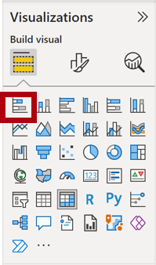
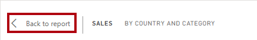

---
lab:
  course: 'PL-300, DP-605'
  title: Criar um Relatório no Power BI Desktop
  module: Create Reports in Power BI Desktop
---

# Criar um Relatório no Power BI Desktop

## **História do laboratório**

Neste laboratório, você criará um relatório de três páginas. Você então publicará o relatório no Power BI, onde será possível abri-lo e interagir com ele.

Neste laboratório, você aprenderá a:

- Projetar um relatório
- Configurar campos visuais e propriedades de formato

**Este laboratório levará aproximadamente 45 minutos.**

## **Criar um Relatório**

Nesta tarefa, você vai configurar o ambiente para o laboratório abrindo o relatório inicial.

1. No Power BI Desktop, navegue até **Abrir > Procurar neste dispositivo**.

1. Abra o arquivo **Análise de vendas** na pasta **D:\Allfiles\Labs\06-design-report-in-power-bi-desktop\Starter**.

   *Observação: neste momento, o Power BI solicitará que você entre se ainda não tiver entrado. Você pode entrar ou clicar em **Cancelar** e continuar o laboratório.*

1. Crie uma cópia do arquivo acessando **Arquivo** > **Salvar como**e salve a cópia na pasta **D:\Allfiles\MySolution**.

## **Página de design 1**

Nesta tarefa, você criará a primeira página de relatório. Quando você tiver concluído o design, a página terá a seguinte aparência:

1. No Power BI Desktop, para renomear a página, no canto inferior esquerdo, clique com o botão direito do mouse na **Página 1** e, em seguida, **Renomeie** a página como **Visão Geral**.

    *Dica: você também pode clicar duas vezes no nome da página.*

1. Para adicionar uma imagem, na guia de faixa de opções **Inserir**, no grupo **Elementos**, selecione **Imagem**.

    

1. Na janela **Abrir**, navegue até a pasta **D:\Allfiles\Resources**.

1. Selecione o arquivo **AdventureWorksLogo.jpg** e escolha **Abrir**.

1. Arraste a imagem para posicioná-la no canto superior esquerdo e também arraste os marcadores de guia para redimensioná-la.

     

1. Para adicionar uma segmentação, primeiro cancele a seleção da imagem clicando em uma área vazia da página do relatório e, em seguida, selecione a **Segmentação** no painel **Visualizações**.

     

1. No painel **Data**, arraste o campo **Data \| Ano** (não o nível da hierarquia **Ano**) na segmentação **Campo** no painel Visualizações.
    
    *Os laboratórios usam uma notação taquigráfica para fazer referência a um campo. Ficará assim: **Data \| Ano**. Neste exemplo, **Data** é o nome da tabela e **Ano** é o nome do campo.*

1. Para converter a segmentação de dados de uma lista suspensa, navegue até **Visualizações > Formatar visual > Visual > Configurações da segmentação > Estilo** e, em seguida, selecione **Lista Suspensa** no menu suspenso.

    

1. Redimensione e posicione a segmentação de modo que ela fique abaixo da imagem e tenha a mesma largura dela.

     

1. Na segmentação **Ano**, abra a lista suspensa, selecione **FY2020** e, em seguida, feche a lista suspensa.
    1. *Agora a página de relatório é filtrada pelo ano **FY2020**.*

     

1. Desmarque a segmentação clicando em uma área vazia da página do relatório.

1. Crie uma segunda segmentação com base no campo **Região \| Região** (não o nível **Região** da hierarquia).

1. Deixe a segmentação como uma lista e redimensione e posicione a segmentação abaixo da segmentação **Ano**.

     

1. Desmarque a segmentação clicando em uma área vazia da página do relatório.

1. Para adicionar um gráfico à página, no painel **Visualizações**, selecione o tipo de visual **Gráfico de Linhas e Colunas Empilhadas**.

     

1. Redimensione e posicione o visual para que ele fique à direita do logotipo e, portanto, preencha a largura da página do relatório.

     

1. Arraste e solte os seguintes campos para o visual:

     - Data \| Mês
     - Vendas \| Vendas

1. No painel de campos visuais (localizado abaixo do painel **Visualizações**), observe que os campos são atribuídos às caixas/áreas do **eixo X** e do **eixo Y da coluna**.
    
    *Ao arrastar campos para um visual, eles serão adicionados a campos/áreas padrão. Para precisão, você pode arrastar campos diretamente para as caixas/áreas, como fará a seguir.*

     

1. No painel **Data**, arraste o campo **Vendas \| Margem de Lucro** para o campo/área **Eixo Y da linha**.

     

1. Observe que o visual tem apenas 11 meses.
    
    *O último mês do ano, junho de 2020, não tem vendas (ainda). Por padrão, o visual eliminou meses com vendas em BRANCO. Agora você configurará o visual para mostrar todos os meses.*

1. No painel campos do visual, na caixa/área **Eixo X**, para o campo **Mês**, escolha a seta para baixo e selecione **Mostrar Itens Sem Dados**.
    
    *Observe que o mês de **junho de 2020** aparece agora.*

     

1. Desmarque o gráfico clicando em uma área vazia da página do relatório.

1. Para adicionar um gráfico à página, no painel **Visualizações**, selecione o tipo de visual **Gráfico de Colunas Empilhadas**.

     

1. Redimensione e posicione o visual para que ele fique abaixo do gráfico de colunas/linhas e, portanto, preencha metade da largura do gráfico acima.

     

1. Adicione os seguintes campos às caixas/áreas de visual:

     - Eixo X: **Região \| País**
     - Eixo Y: **Vendas \| Vendas**
     - Legenda: **Produto \| Categoria**

1. Desmarque o gráfico clicando em uma área vazia da página do relatório.

1. Para adicionar um gráfico à página, no painel **Visualizações**, clique no tipo de visual **Gráfico de Barras Empilhadas**.

     

1. Redimensione e posicione o visual para que ele preencha o espaço restante da página do relatório.

     

1. Adicione os seguintes campos às caixas/áreas de visual:

     - Eixo Y: **Produto \| Categoria**
     - Eixo X: **Vendas \| Quantidade**

1. Para formatar o visual, abra o painel **Formatar**.

     

1. Expanda as **Barras** e, em seguida, o grupo **Cores** e defina a propriedade **Cor Padrão** com uma cor adequada (em contraste com o gráfico de colunas/linhas).

1. Defina a propriedade **Rótulos de Dados** como **Ativado**.

     

1. Salve o arquivo do Power BI Desktop.

*O design da primeira página agora está concluído.*

## **Página de design 2**

Nesta tarefa, você criará a segunda página de relatório. Quando você tiver concluído o design, a página terá a seguinte aparência:

 

*Importante: Quando instruções detalhadas já foram fornecidas nos laboratórios, as etapas do laboratório fornecerão instruções mais concisas. Se você precisar das instruções detalhadas, você pode consultar outras tarefas neste laboratório.*

1. Para criar uma nova página, no canto inferior esquerdo, selecione o ícone de adição e renomeie a nova página como **Lucro**.

1. Adicione uma segmentação com base no campo **Região \| Região**.

1. Use o painel **Formatar** para habilitar a opção "Selecionar Tudo" (no grupo **Configurações de segmentação > Seleção**).

1. Redimensione e posicione a segmentação de modo que ela fique no lado esquerdo da página do relatório e, portanto, tenha cerca de metade da altura da página.

     

1. Adicionar um visual de matriz, redimensioná-lo e posicioná-lo para que ele preencha o espaço restante da página de relatório

     

1. Adicione a hierarquia **Data \| Fiscal** à matriz da caixa/área **Linhas**.

     

1. Adicione os cinco campos de tabela **Vendas** seguintes à caixa/área **Valores**:

     - Pedidos (da pasta **Contagens**)
     - Vendas
     - Custo
     - Lucro (na pasta **Preços**)
     - Margem de lucro (na pasta **Preços**)

     

1. No painel **Filtros** (localizado à esquerda do painel **Visualizações**), observe a caixa/área **Filtrar Nesta Página** (talvez seja necessário rolar para baixo).

     

1. No painel **Dados**, arraste o campo **Produto \| Categoria** para a caixa/área **Filtrar Nesta Página**.
    
    *Os campos adicionados ao painel **Filtros** podem obter o mesmo resultado que uma segmentação de dados. Uma diferença é que eles não ocupam espaço na página do relatório. Outra diferença é que eles podem ser configurados para atender a requisitos de filtragem mais sofisticados.*

1. No cartão de filtro, no canto superior direito, selecione a seta para recolher o cartão.

1. Adicione cada um dos seguintes campos da tabela **Produto** à caixa/área **Filtrar Nesta Página**, recolhendo cada um, diretamente abaixo do cartão **Categoria**:

     - Subcategoria
     - Product
     - Cor

     

1. Salve o arquivo do Power BI Desktop.

 *O design da segunda página agora está concluído.*

## **Página de design 3**

Nesta tarefa, você criará a terceira e última página do relatório. Quando você tiver concluído o design, a página terá a seguinte aparência:

 

1. Crie uma página e renomeie-a como **Meu Desempenho**.

1. Para simular o desempenho dos filtros de segurança em nível de linha, arraste o campo **Vendedor (Desempenho) \| Vendedor** para os filtros de nível de página no painel de filtros.

     

1. Selecione **Michael Blythe**. Os dados na página do relatório **Meu Desempenho** agora serão filtrados para exibir dados somente para Michael Blythe.

1. Adicione uma segmentação suspensa com base no campo **Data \| Ano** e redimensione e posicione-o para que fique no canto superior esquerdo da página.

     

1. Na segmentação, defina a página para filtrar o conteúdo por **FY2019**.

     

1. Adicione um visual **Cartão de Várias Linhas** e redimensione-o e reposicione-o para que ele fique à direita da segmentação e preencha a largura restante da página.

     

     

1. Adicione os quatro seguintes campos ao visual:

     - Vendas \| Vendas
     - Metas \| Meta
     - Metas \| Variância
     - Metas \| Margem de Variância

1. Formatar o Visual:

     - No grupo **Valores do balão**, aumente a propriedade **Tamanho do Texto** para **28pt**

     - No grupo **Geral > Efeitos > Plano de Fundo**, defina a **Cor** como uma cor cinza claro (como "Branco, 20% Mais Escuro) para fornecer contraste

         

1. Adicione um visual **Gráfico de Barras em Cluster**. Em seguida, redimensione e posicione-o para que fique abaixo do visual de cartão de várias linhas e preencha a altura restante da página e metade da largura do visual do cartão de várias linhas.

     

     

1. Adicione os seguintes campos às caixas/áreas de visual:

     - Eixo Y: **Data \| Mês**
     - Eixo X: **Vendas \| Vendas** e **Metas \| Metas**

         

1. Para criar uma cópia do visual, pressione **Ctrl+C** e **Ctrl+V**.

1. Posicione o novo visual à direita do visual original.

     

1. Para modificar o tipo de visualização, no painel **Visualizações**, selecione **Gráfico de Colunas em Cluster**.

     

 *Agora é possível ver os mesmos dados expressos por dois tipos de visualização diferentes. Esse não é um bom uso do layout de página, no entanto, você o aprimorará no laboratório **Aprimorar um Relatório no Power BI Desktop** sobrepondo os elementos visuais. Ao adicionar botões à página, você permitirá que o usuário do relatório determine qual dos dois elementos visuais está visível.*

 *Agora, o design da terceira página (a final também) está completo.*

## **Publicar o relatório**

Nesta tarefa, você vai publicar o relatório no serviço do Power BI.

1. Selecione a página **Visão geral** e salve o arquivo do Power BI Desktop.

1. Na guia de faixa de opções **Página Inicial**, no grupo **Compartilhar**, selecione **Publicar**.
    
    *Se você já entrou no Power BI Desktop, não precisa entrar novamente para publicar.*

     

1. Na janela **Publicar no Power BI**, observe que **Meu Workspace** está selecionado.
    
    *Não entraremos em detalhes sobre os diferentes itens dentro do serviço do Power BI neste laboratório.*

1. Para publicar o relatório, escolha **Selecionar**. Isso pode demorar alguns instantes. 
1. Quando a publicação for bem-sucedida, selecione **Entendi**.

## **Explorar o relatório**

Nesta tarefa, você vai explorar o relatório publicado no Power BI.

1. Abra um navegador Microsoft Edge e entre em **https://app.powerbi.com**.

1. Na janela do navegador do Microsoft Edge, no serviço do Power BI, no painel **Navegação** (localizado à esquerda, possivelmente recolhido), expanda **Meu Workspace**.

    

1. Revise o conteúdo do workspace.
    1. *Pode existir quatro tipos de itens em um workspace, e falaremos sobre **relatórios** e **modelos semânticos**.*
    1. *Talvez seja necessário atualizar o navegador Microsoft Edge se o modelo semântico não estiver visível.*
    1. *Quando você publicou o arquivo do Power BI Desktop, o modelo de dados foi publicado como um modelo semântico.*

1. Para explorar o relatório, selecione o relatório **Análise de Vendas**.

1. À esquerda, no painel **Páginas**, selecione a página **Visão Geral**.

1. Na segmentação **Regiões**, ao pressionar a tecla **Ctrl**, selecione várias regiões.

1. No gráfico de colunas/linhas, selecione qualquer coluna de mês para realizar a filtragem cruzada da página.

1. Enquanto pressiona a tecla **Ctrl**, selecione outro mês.

     *Observação: por padrão, a filtragem cruzada filtra os outros visuais da página.*

1. Observe que o gráfico de barras é filtrado e realçado, com a parte em negrito das barras representando os meses filtrados.

1. Posicione o cursor sobre o visual do gráfico de barras e, no canto superior direito, posicione-o novamente sobre o ícone de filtro. 
    
    *O ícone de filtro permite que você compreenda todos os filtros aplicados ao visual, incluindo segmentações e filtros cruzados de outro visual.*

1. Passe o cursor sobre uma barra e observe as informações da dica de ferramentas.

1. Para desfazer o filtro cruzado, no gráfico de colunas/linhas, selecione uma área vazia do visual.

1. Posicione o cursor sobre o visual do gráfico da coluna empilhada e, no canto superior direito, selecione o ícone **Modo de foco**.
    
    *O modo de foco amplia o visual para o tamanho total da página.*

     

1. Focalize o cursor sobre segmentos diferentes dos gráficos de barra para revelar dicas de ferramentas.

1. Para voltar à página do relatório, no canto superior esquerdo, selecione **Voltar ao Relatório**.

     

1. Posicione o cursor sobre os visuais novamente e, em seguida, no canto superior direito, selecione as reticências (…) e observe as opções de menu. Experimente cada uma das opções, exceto **Conversar no Teams**.

     

1. À esquerda, no painel **Páginas**, selecione a página **Lucro**.

     

1. Observe que a segmentação **Região** tem uma seleção diferente para a segmentação **Região** na página **Visão Geral**.
    
    *As segmentações não estão sincronizadas. Você modificará o design do relatório para garantir que elas sejam sincronizadas entre as páginas no laboratório **Criar um relatório no Power BI Desktop**.*

1. No painel **Filtros** (localizado à direita), expanda um cartão de filtro e aplique alguns filtros.
    
    *O painel **Filtros** permite que você defina mais filtros do que podem caber em uma página como segmentações.*

1. No visual de matriz, use o botão de adição (+) para analisar a hierarquia **Fiscal**.

1. Selecione a página **Meu Desempenho**.

     

1. No canto superior direito da barra de menus, selecione **Exibição** e escolha **Tela Inteira**.

     

1. Interaja com a página modificando a segmentação e realizando a filtragem cruzada da página.

1. No canto inferior da janela, observe os comandos para mudar de página, navegar para trás ou para frente entre as páginas ou para sair do modo de tela inteira.

1. Selecione o ícone direito para sair do modo de tela cheia.

     

### **Conclusão**

Nesta tarefa, você concluirá o laboratório.

Para retornar a "Meu Workspace", selecione **Meu Workspace** no banner na página da Web da janela.

 *Você vai aprimorar o design do relatório com recursos avançados no laboratório **Aprimorar um Relatório no Power BI Desktop**.*
