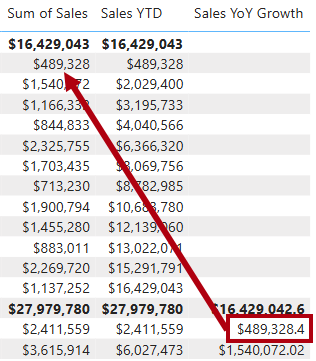

---
lab:
  title: Usar funções de inteligência de dados temporais do DAX no Power BI
  module: Use DAX time intelligence functions in Power BI
---

# Usar funções de inteligência de dados temporais do DAX no Power BI

## História do laboratório

Neste laboratório, você criará medidas com expressões DAX que envolvem inteligência de dados temporais.

Neste laboratório, você aprenderá a:

 - Usar várias funções de inteligência de dados temporais para manipular o contexto de filtro que diz respeito a datas específicas.

**Este laboratório levará aproximadamente 15 minutos.**

## Introdução

Para concluir este exercício, primeiro abra um navegador da Web e insira a seguinte URL para baixar o arquivo zip:

`https://github.com/MicrosoftLearning/PL-300-Microsoft-Power-BI-Data-Analyst/raw/Main/Allfiles/Labs/06-use-dax-time-intelligence/06-time-intelligence.zip`

Extraia o arquivo para a pasta **C:\Users\Student\Downloads\06-time-intelligence**.

Abra o arquivo **06-Starter-Sales Analysis.pbix**.

> _**Observação**: Você pode ver uma caixa de diálogo de entrada enquanto o arquivo é carregado. Selecione **Cancelar** para ignorar a caixa de diálogo de entrada. Feche todas as janelas informativas. Caso precise aplicar as alterações, clique em **Aplicar depois**._

## Criar uma medida YTD

Nesta tarefa, você criará uma medida de vendas YTD (acumuladas no ano) usando funções de inteligência de dados temporais.

1. No Power BI Desktop, no **modo de exibição Relatório**, na **Página 2**, observe o visual da matriz que apresenta várias medidas com anos e meses agrupados nas linhas.

2. Adicione uma medida à tabela `Sales`, com base na expressão seguinte, e formate-a para zero casas decimais:

    ```dax
    Sales YTD =
    TOTALYTD(
        SUM(Sales[Sales]),
        'Date'[Date],
        "6-30"
    )
    ```

    > _A função `TOTALYTD` avalia uma expressão, neste caso, a soma da coluna `Sales`, de acordo com uma coluna de data especificada. A coluna de data deve pertencer a uma tabela de data marcada como uma tabela de data._
    >
    > _A função também pode usar um terceiro argumento opcional representando a última data de um ano. A ausência dessa data significa que 31 de dezembro é a última data do ano. Na Adventure Works, junho é o último mês do ano, portanto, assim o argumento "6-30" é usado._

3. Adicione o campo `Sales` e a medida `Sales YTD` ao visual da matriz.

4. Observe o acúmulo de valores de vendas durante o ano.

    

> _A função `TOTALYTD` executa a manipulação de filtro, especificamente manipulação de filtros de tempo. Por exemplo, para computar vendas YTD para setembro de 2017 (terceiro mês do ano fiscal), todos os filtros na tabela `Date` são removidos e substituídos por um novo filtro de datas que começa no início do ano (1º de julho de 2017) e estende-se até a última data do período dentro do contexto (30 de setembro de 2017)._
>
> _Muitas [funções de inteligência de dados temporais](/dax/time-intelligence-functions-dax/?azure-portal=true) estão disponíveis em DAX para dar suporte a manipulações de filtros de tempo comuns._

## Criar uma medida de crescimento YoY

Nesta tarefa, você criará uma medida de crescimento de vendas ano a ano usando uma variável.

> As variáveis ajudam a simplificar a fórmula e são mais eficientes se usarem a lógica várias vezes dentro de uma fórmula. As variáveis são declaradas por um nome exclusivo, e a expressão de medida deve ser emitida depois da palavra-chave `RETURN`. Ao contrário de algumas outras variáveis de linguagem de codificação, as variáveis DAX só podem ser usadas com a fórmula única._

1. Adicione outra medida à tabela `Sales`, com base na seguinte expressão:

    ```dax
    Sales YoY Growth =
    VAR SalesPriorYear =
        CALCULATE(
            SUM(Sales[Sales]),
            PARALLELPERIOD(
                'Date'[Date],
                -12,
                MONTH
            )
        )
    RETURN
        SalesPriorYear
    ```

    > _A variável `SalesPriorYear` recebe uma expressão que calcula a soma da coluna `Sales` em um contexto modificado. Esse contexto usa a função `PARALLELPERIOD` para mudar 12 meses de volta de cada data no contexto de filtro._

1. Adicione a nova medida `Sales YoY Growth` ao visual da matriz.

1. Observe que a nova medida retorna `BLANK` para os primeiros 12 meses (não foram registradas vendas antes do ano fiscal de 2017).

1. Observe que o valor da medida de `Sales YoY Growth` para _julho de 2018_ é o valor de vendas para _julho de 2017_.

    

    > _Agora que a parte “difícil” da fórmula foi testada, você pode substituir a medida pela fórmula final que calcula o resultado de crescimento._

1. Para completar a medida, substitua a medida `Sales YoY Growth` por esta fórmula, formatando-a como uma porcentagem com duas casas decimais:

    ```dax
    Sales YoY Growth =
    VAR SalesPriorYear =
        CALCULATE(
            SUM(Sales[Sales]),
            PARALLELPERIOD(
                'Date'[Date],
                -12,
                MONTH
            )
        )
    RETURN
        DIVIDE(
            (SUM(Sales[Sales]) - SalesPriorYear),
            SalesPriorYear
        )
    ```

1. Na fórmula, na cláusula `RETURN`, observe que a variável é referenciada duas vezes.

1. Verifique que o crescimento YoY para _julho de 2018_ é de 392,83%.

    

    > _A medida de crescimento YoY identifica um aumento de quase 400% (ou 4x) das vendas durante o mesmo período do ano anterior._

1. No **modo de exibição Modelo**, coloque as duas novas medidas em uma pasta de exibição chamada _Inteligência de dados temporais_.

    

1. Salve o arquivo do Power BI Desktop.

## Laboratório concluído

Você pode optar por salvar seu relatório do Power BI, embora isso não seja necessário para este laboratório. No próximo exercício, você trabalhará com um arquivo inicial pré-criado.

1. Navegue até o menu **"Arquivo"** no canto superior esquerdo e selecione **"Salvar como"**. 
1. Selecione **Procurar neste dispositivo**.
1. Selecione a pasta na qual você deseja salvar o arquivo e dê a ele um nome descritivo. 
1. Selecione o botão **Salvar** para salvar o relatório como um arquivo .pbix. 
1. Se for exibida uma caixa de diálogo solicitando a aplicação das alterações de consulta pendentes, selecione **Aplicar**.
1. Feche o Power BI Desktop.