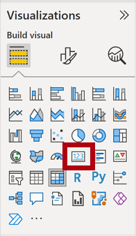
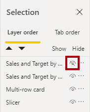

---
lab:
  course: PL-300
  title: Aprimorar um Relatório no Power BI Desktop
  module: Create Reports in Power BI desktop
---

# Aprimorar um Relatório no Power BI Desktop

## **História do laboratório**

Neste laboratório, você vai aprimorar a **Análise de Vendas** com recursos de design avançados.

Neste laboratório, você aprenderá a:

- Sincronizar segmentações
- Criar uma página de detalhamento
- Aplicar formatação condicional
- Criar e usar indicadores

**Este laboratório levará aproximadamente 45 minutos.**

## **Introdução – Conectar-se**

Nesta tarefa, você vai configurar o ambiente para o laboratório entrando no Power BI.

*Se você já entrou no Power BI, vá para a próxima tarefa.*

1. Para abrir o Microsoft Edge, na barra de tarefas, selecione o atalho do programa Microsoft Edge.

     

1. Na janela do navegador Microsoft Edge, navegue até **https://app.powerbi.com**.

    *Dica: use também o favorito do Serviço do Power BI na barra de favoritos do Microsoft Edge.*

1. Conclua o processo de entrada com suas credenciais organizacionais (ou aquelas fornecidas a você). Se você receber um aviso do Microsoft Edge para permanecer conectado, selecione **Sim**.

1. Na janela do navegador Microsoft Edge, no serviço do Power BI, no painel **Navegação**, expanda **Meu Workspace**. Mantenha a janela do navegador Microsoft Edge aberta.

     

## **Introdução – Abrir relatório**

Nesta tarefa, você vai configurar o ambiente para o laboratório abrindo o relatório inicial.

*Importante: se estiver dando continuidade ao laboratório anterior (e concluiu esse laboratório com sucesso), não conclua essa tarefa; em vez disso, vá para a próxima tarefa.*

1. Abra o Power BI Desktop.

    

1. Para abrir o arquivo inicial do Power BI Desktop, slecione **Abrir > Procurar neste dispositivo**.

1. Na janela **Abrir**, navegue até a pasta **D:\Allfiles\Labs\07-design-report-in-power-bi-desktop-enhanced\Starter** e abra o arquivo **Análise de Vendas**.

   *Observação: neste momento, o Power BI solicitará que você entre se ainda não tiver entrado. Você pode entrar ou clicar em **Cancelar** e continuar o laboratório.*

1. Feche todas as janelas informativas que possam ser abertas.

1. Observe a mensagem de aviso abaixo da faixa de opções.

    *Essa mensagem alerta para o fato de que as consultas não foram aplicadas para carregar como tabelas de modelo. Você aplicará as consultas posteriormente neste laboratório.*

    *Para ignorar a mensagem de aviso, à direita da mensagem de aviso, selecione **X**.*

1. Para criar uma cópia do arquivo, vá para **Arquivo > Salvar como** e salve na pasta **D:\Allfiles\MySolution**.

1. Caso precise aplicar as alterações, selecione **Aplicar Mais Tarde**.

## **Sincronizar segmentações**

Nesta tarefa, você sincronizará as segmentações **Ano** e **Região**, continuando o desenvolvimento do relatório criado no laboratório **Criar um Relatório no Power BI Desktop**.

1. No Power BI Desktop, na página **Visão geral**, defina a segmentação **Year** como **FY2018**.

1. Acesse a página **Meu Desempenho** e observe que a segmentação **Ano** tem um valor diferente.

    *Quando a segmentação de dados não é sincronizada, ela pode contribuir para representar incorretamente os dados e a frustração dos usuários de relatório. Agora, você sincronizará as segmentações do relatório.*

1. Volte à página **Visão geral** e selecione a segmentação **Year**.

1. Na guia de faixa de opções **Exibir**, no grupo **Mostrar Painéis**, selecione **Sincronizar Segmentações**.

     

1. No painel **Segmentação de Dados de Sincronização** (à esquerda do painel **Visualizações**), na segunda coluna (que representa a sincronização), marque as caixas de seleção para as páginas **Visão Geral** e **Meu Desempenho**.

     

1. Na página **Visão Geral**, selecione a segmentação **Região**.

1. Sincronize a segmentação com as páginas **Visão Geral** e **Lucro**.

     

1. Teste a sincronização das segmentações selecionando opções de filtro diferentes e verificando se as segmentações sincronizadas são filtradas pela mesma seleção.

1. Para fechar a página **Segmentação de sincronização**, selecione a opção **Segmentação de sincronização** localizada na guia de faixa de opções **Exibir**.

## **Configurar detalhamento**

Neste exercício, você vai criar uma página e vai configurá-la como uma página de detalhamento. Quando você tiver concluído o design, a página terá a seguinte aparência:

## **Criar uma página de detalhamento**

Nesta tarefa, você vai criar uma página e vai configurá-la como uma página de detalhamento.

1. Adicione uma nova página de relatório denominada **Detalhes do Produto**.

1. Clique com o botão direito do mouse na guia da página **Detalhes do Produto** e selecione **Ocultar Página**.

    *Os usuários do relatório não poderão acessar a página de detalhamento diretamente. Eles precisarão acessá-lo a partir de imagens em outras páginas. Você aprenderá a detalhar a página no exercício final deste laboratório.*

1. Embaixo do painel **Visualizações**, na seção **Detalhamento**, adicione o campo **Produto \| Categoria** à caixa **Adicionar Campos de Detalhamento Aqui**.

    *Os laboratórios usam uma notação taquigráfica para fazer referência a um campo. Ficará assim: **Produto \| Categoria**. Neste exemplo, **Produto** é o nome da tabela e **Categoria** é o nome do campo.*

     

1. Para testar a página de detalhamento, no cartão de filtro de detalhamento, selecione **Bicicletas**.

     

1. Na parte superior esquerda da página de relatório, observe o botão de seta.

    *Um botão de seta é adicionado automaticamente quando um campo é adicionado ao detalhamento através da caixa/área. Ele permite que os usuários do relatório naveguem de volta para a página a partir da qual eles fizeram o detalhamento.*

1. Adicione um visual **Cartão** à página e redimensione-o e posicione-o para que ele fique à direita do botão e preencha a largura restante da página.

    

    

1. Arraste o campo **Produto \| Categoria** para o visual do cartão.

1. Configure as opções de formato para o visual e transforme a propriedade **Rótulo da Categoria** em **Desativado**.

     

1. Defina a propriedade **Efeitos > Tela de fundo** como uma tonalidade clara de cinza como *Branco, 20% mais escuro*.

     

1. Adicione um visual **Tabela** à página e redimensione-o e posicione-o para que ele fique embaixo do visual de cartão e preencha o espaço restante na página.

     

     

1. Adicione os seguintes campos ao visual:

     - Produto \| Subcategoria
     - Produto \| Cor
     - Vendas \| Quantidade
     - Vendas \| Vendas
     - Vendas \| Margem de Lucro

1. Configure as opções de formato para o visual e, na seção **Valores**, defina a propriedade **Tamanho do Texto** como **20pt**.

*O design da página de detalhamento está quase completo. Você aprimorará a página com formatação condicional no próximo exercício.*

## **Adicionar Formatação Condicional**

Neste exercício, você vai aprimorar a página de detalhamento com formatação condicional. Quando você tiver concluído o design, a página terá a seguinte aparência:

## **Adicionar formatação condicional**

Nesta tarefa, você vai aprimorar a página de detalhamento com formatação condicional.

1. Selecione o visual de tabela. No painel de visualização, selecione a seta para baixo no valor **Margem de Lucro** e, em seguida, selecione **Formatação Condicional \| Ícones**.

    

1. Na janela **Ícones – Margem de Lucro**, na lista suspensa **Layout do Ícone**, selecione **À Direita dos Dados**.

     

1. Para excluir a regra intermediária, à esquerda do triângulo amarelo, selecione **X**.

     

1. Configure a primeira regra (losango vermelho) da seguinte maneira:

    - No segundo controle, remova o valor
    - No terceiro controle, selecione **Número**
    - No quinto controle, digite **0**
    - No sexto controle, selecione **Número**

1. Configure a segunda regra (círculo verde) da seguinte maneira e, em seguida, selecione **OK**:

    *As regras podem ser interpretadas assim: exiba um losango vermelho se o valor da margem de lucro for menor que 0; caso contrário, se o valor for maior ou igual a zero, exiba um círculo verde.*

     - No segundo controle, digite **0**
     - No terceiro controle, selecione **Número**
     - No quinto controle, remova o valor
     - No sexto controle, selecione **Número**

     

1. No visual da tabela, verifique se os ícones corretos são exibidos.

     

1. Configure a formatação condicional de cor da tela de fundo para o campo **Cor**.

1. Na janela **Cor da tela de fundo – Cor**, na lista suspensa **Estilo de Formatação**, selecione **Valor do Campo**.

1. Na lista suspensa **Com base no campo**, selecione **Produto \| Formatação \| Formato da Cor do Plano de Fundo** e, em seguida, **OK**.

     

1. Repita as etapas anteriores para configurar a formatação condicional de cor da fonte para o campo **Cor**, usando o campo **Produto \| Formatação \| Formato da Cor da Fonte**

*Talvez você se lembre de que as cores da tela de fundo e da fonte foram obtidas do arquivo **ColorFormats.csv** no laboratório **Preparar Dados no Power BI Desktop** e integradas à consulta **Produto** no laboratório **Carregar Dados no Power BI Desktop**.*

## **Adicionar indicadores e Botões**

Neste exercício, você vai aprimorar a página **Meu Desempenho** com botões, permitindo que o usuário do relatório selecione o tipo de visual a ser exibido. Quando você tiver concluído o design, a página terá a seguinte aparência:

## **Adicionar indicadores**

Nesta tarefa, você adicionará dois indicadores, um para exibir cada um dos visuais mensais de vendas/metas.

1. Acesse a página **Meu Desempenho**. Na guia de faixa de opções **Exibir**, no grupo **Mostrar Painéis**, selecione **Indicadores**.

     

1. Na guia de faixa de opções **Exibir**, no grupo **Mostrar Painéis**, escolha **Seleção**.

1. No painel **Seleção**, ao lado de um dos itens de **Vendas e Meta por Mês**, para ocultar o visual, selecione o ícone de olho.

     

1. No painel **Indicadores**, selecione **Adicionar**.

    *Para renomear o indicador, clique duas vezes no indicador.*

     

1. Se o gráfico visível for o gráfico de barras, renomeie o indicador como **Gráfico de Barras ATIVADO**; caso contrário, renomeie o indicador como **Gráfico de Colunas ATIVADO**.

1. Para editar o indicador, no painel **Indicadores**, posicione o cursor sobre o indicador, clique nas reticências e selecione **Dados**.
     
     *Desabilitar a opção **Dados** significa que o indicador não usará o estado de filtro atual. Isso é importante porque, caso contrário, o marcador bloquearia permanentemente o filtro atualmente aplicado pela segmentação de dados **Ano**.*

     

1. Para atualizar o indicador, clique nas reticências novamente e selecione **Atualizar**.

     *Nas etapas a seguir, você vai criar e configurar um segundo indicador para mostrar o segundo visual.*

1. No painel **Seleção**, alterne a visibilidade dos dois itens **Vendas e Meta por Mês**.

     *Em outras palavras, torne o visual visível oculto e torne o visual oculto visível.*

     

1. Crie um segundo indicador e nomeie-o adequadamente (**Gráfico de Colunas ATIVADO** ou **Gráfico de Barras ATIVADO).**

     

1. Configure o segundo indicador para ignorar filtros (opção **Dados** desativada) e atualize o indicador.

1. No painel **Seleção**, para tornar os dois visuais visíveis, basta mostrar o visual oculto.

1. Redimensione e reposicione os dois visuais para que eles preencham a página embaixo do visual de vários cartões e se sobreponham completamente.

    *Para selecionar o visual coberto, selecione-o no painel **Seleção**.*

    

1. No painel **Indicadores**, selecione cada um dos indicadores e observe que apenas um dos visuais está visível.

*A próxima fase do design é adicionar dois botões à página, o que permitirá que o usuário do relatório selecione os indicadores.*

## **Adicionar botões**

Nesta tarefa, você vai adicionar dois botões e atribuir ações de indicador a cada um.

1. Na faixa de opções **Inserir**, no grupo **Elementos**, selecione **Botão** e **Em Branco**.

     

1. Reposicione o botão diretamente abaixo da segmentação **Ano**.

1. Selecione o botão e, no painel do **botão Formatar**, selecione **Botão**, expanda a seção **Estilo** e defina a propriedade **Texto** como **Ativa**.

     

1. Expanda a seção **Texto** e, na caixa **Texto**, insira **Gráfico de Barras**.

1. Expanda a seção **Preenchimento** e defina uma cor da tela de fundo usando uma cor complementar.

1. Selecione **Botão** e defina a propriedade **Ação** como **Ativa**.

    

1. Expanda a seção **Ação** e defina a lista suspensa **Tipo** como **Indicador**.

1. Na lista suspensa **Indicador**, selecione **Gráfico de Barras ATIVADO**.

    

1. Crie uma cópia do botão usando copiar e colar e configure o novo botão da seguinte maneira:

    *Dica: os comandos de atalho para copiar e colar o conteúdo são **Ctrl+C** seguido de **Ctrl+V**.*

    - Defina a propriedade **Texto do Botão** como **Gráfico de Colunas**
    - Na seção **Ação**, defina a lista suspensa **Indicador** como **Gráfico de Colunas ATIVADO**

*Agora, o design do relatório Análise de Vendas está completo.*

## **Publicar o relatório**

Nesta tarefa, você publicará o relatório.

1. Selecione a página **Visão Geral**.

1. Na segmentação **Ano**, selecione **FY2020**.

1. Na segmentação **Região**, selecione **Selecionar Tudo**.

1. Salve o arquivo do Power BI Desktop.

    *O arquivo sempre precisa ser salvo antes de ser publicado no serviço do Power BI.*

1. Na guia de faixa de opções **Página Inicial**, no grupo **Compartilhar**, selecione **Publicar**.

     

1. Na janela **Publicar no Power BI**, observe que **Meu Workspace** está selecionado.

1. Para publicar o relatório, escolha **Selecionar**.
    1. Caso precise substituir o modelo semântico, selecione **Substituir**.
    1. Quando a publicação for bem-sucedida, selecione **Entendi**.

1. Feche o Power BI Desktop.

*No próximo exercício, você vai explorar o relatório no serviço do Power BI.*

## **Explorar o relatório**

Nesta tarefa, você vai explorar o relatório no serviço do Power BI.

1. Na janela do navegador Microsoft Edge, navegue para o serviço do Power BI > **Meu Workspace** e, em seguida, selecione o relatório **Análise de Vendas**.

1. Para testar o recurso de detalhamento, navegue até a página **Visão geral** > visual **Quantidade por Categoria**. Em seguida, clique com o botão direito do mouse na barra **Roupas** e selecione **Detalhar \| Detalhes do Produto**.

     

1. Observe que a página **Detalhes do Produto** é para **Roupas**.

1. Para voltar à página de origem, no canto superior esquerdo da página, selecione o botão de seta.

1. Selecione a página **Meu Desempenho**.

    *Selecione cada um dos botões e observe que um visual diferente é exibido.*

### **Conclusão**

Nesta tarefa, você concluirá o laboratório.

Para retornar ao seu workspace, no banner na página da Web da janela, selecione **Meu workspace**.

