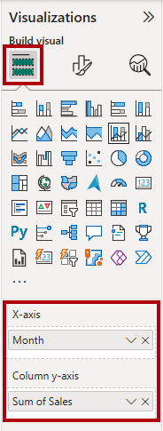
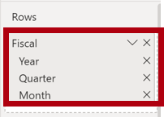
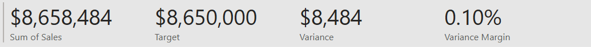

---
lab:
  title: Projetar relatórios do Power BI
  module: Design Power BI reports
---

# Projetar relatórios do Power BI

## História do laboratório

Neste laboratório, você criará um relatório de três páginas. Você então publicará o relatório no serviço do Power BI, onde será possível abri-lo e interagir com ele.

Neste laboratório, você aprenderá a:

- Projetar um relatório.
- Configurar campos visuais e propriedades de formato.
- Sincronizar segmentações.
- Publique o relatório no serviço do Power BI.
- Interagir com um relatório e seus visuais.

**Este laboratório levará aproximadamente 45 minutos.**

## Introdução

Para concluir este exercício, primeiro abra um navegador da Web e insira a seguinte URL para baixar um arquivo zip:

`https://github.com/MicrosoftLearning/PL-300-Microsoft-Power-BI-Data-Analyst/raw/Main/Allfiles/Labs/08-design-power-bi-reports/08-design-report.zip`

Extraia o arquivo para a pasta **C:\Users\Student\Downloads\08-design-report**.

Abra o arquivo **08-Starter-Sales Analysis.pbix**.

> _**Observação**: você pode ignorar a entrada clicando em **Cancelar**. Feche todas as janelas informativas. Caso precise aplicar as alterações, clique em **Aplicar depois**._

## Página de design 1

Neste exercício, você criará a primeira página de relatório. Quando você tiver concluído o design, a página terá a seguinte aparência:

1. No Power BI Desktop, para renomear a página, no canto inferior esquerdo, clique com o botão direito do mouse em **Página 1** e escolha **Renomear**. Renomeie a página como _Visão geral_.

    > _Dica: você também pode clicar duas vezes no nome da página._

1. Para adicionar uma imagem, na guia de faixa de opções **Inserir**, no grupo **Elementos**, selecione **Imagem**.

    

1. Na janela **Abrir**, navegue até a pasta **C:\Users\Student\Downloads\08-design-report**.

1. Selecione o arquivo **AdventureWorksLogo.jpg** e escolha **Abrir**.

1. Arraste a imagem para posicioná-la no canto superior esquerdo e também arraste os marcadores de guia para redimensioná-la.

    

1. Para adicionar uma segmentação, primeiro cancele a seleção da imagem selecionando uma área vazia da página do relatório e, em seguida, selecione a **Segmentação** no painel **Visualizações**.

    

1. No painel **Dados**, arraste o campo `Date | Year` (não o nível da hierarquia `Year`) na segmentação **Campo** no painel **Visualizações**.

    > _Os laboratórios usam uma notação abreviada para referenciar um campo. Ele terá a seguinte aparência: `Date | Year`. Neste exemplo, `Date` é o nome da tabela e `Year` é o nome do campo._

1. Para converter a segmentação de uma lista em uma lista suspensa, no painel **Visualizações**, selecione **Formatar seu visual**. Expanda **Configurações da segmentação** e defina a lista suspensa **Estilo** para **Menu suspenso**.

    

1. Redimensione e posicione a segmentação de modo que ela fique abaixo da imagem e tenha a mesma largura dela.

    

1. Na segmentação **Ano**, abra a lista suspensa, selecione **FY2020** e, em seguida, feche a lista suspensa.

    > _Agora a página de relatório é filtrada pelo ano **FY2020**._

    

1. Desmarque a segmentação selecionando uma área vazia da página do relatório.

1. Crie uma segunda segmentação com base no campo `Region | Region` (não o nível `Region` da hierarquia).

1. Deixe a segmentação como uma lista e redimensione e posicione a segmentação abaixo da segmentação **Ano**.

    

1. Desmarque a segmentação selecionando uma área vazia da página do relatório.

1. Para adicionar um gráfico à página, no painel **Visualizações**, selecione o tipo de visual **Gráfico de Linhas e Colunas Empilhadas**.

    

1. Redimensione e posicione o visual para que ele fique à direita do logotipo e, portanto, preencha a largura da página do relatório.

    

1. Arraste e solte os seguintes campos para o visual:

     - `Date | Month`
     - `Sales | Sales`

1. No painel de campos visuais (localizado abaixo do painel **Visualizações**), observe que os campos são atribuídos às caixas **Eixo X** e **Eixo Y da coluna**.

    > _Os campos que são arrastados para um visual são adicionados às caixas padrão. Para garantir a precisão, arraste os campos diretamente para as caixas, como fará em seguida._

    

1. No painel **Dados**, arraste o campo `Sales | Profit Margin` para a caixa **Eixo Y da linha**.

    

1. Observe que o visual tem apenas 11 meses.

    > _O último mês do ano, junho de 2020, não tem nenhuma venda (ainda). Por padrão, o visual eliminou meses com vendas `BLANK`. Agora, você configurará o visual para mostrar todos os meses._

1. No painel de campos do visual, na caixa **Eixo X** do campo **Mês**, selecione a seta para baixo e selecione **Mostrar itens sem dados**.

    

    > _Observe que o mês de **junho de 2020** aparece agora._

1. Desmarque o gráfico selecionando uma área vazia da página do relatório.

1. Para adicionar um gráfico à página, no painel **Visualizações**, selecione o tipo de visual **Gráfico de Colunas Empilhadas**.

    

1. Redimensione e posicione o visual para que ele fique abaixo do gráfico de colunas/linhas e, portanto, preencha metade da largura do gráfico acima.

    

1. Adicione os seguintes campos às caixas de visual:

     - X-axis: `Region | Group`
     - Eixo Y: `Sales | Sales`
     - Legenda: `Product | Category`

1. Desmarque o gráfico selecionando uma área vazia da página do relatório.

1. Para adicionar um gráfico à página, no painel **Visualizações**, selecione o tipo de visual **Gráfico de Barras Empilhadas**.

    

1. Redimensione e posicione o visual para que ele preencha o espaço restante da página do relatório.

    

1. Adicione os seguintes campos às caixas de visual:

     - Eixo Y: `Product | Category`
     - X-axis: `Sales | Quantity`

1. Para formatar o visual, abra o painel **Formatar**.

    

1. Expanda a seção **Barras** e, no grupo **Cores**, defina a propriedade **Cor** com uma cor adequada (em contraste com o gráfico de colunas/linhas).

1. Defina a seção **Rótulos de Dados** como **Ativado**.

    

1. Salve o arquivo do Power BI Desktop.

    > _O design da primeira página agora está concluído._

## Página de design 2

Neste exercício, você criará a segunda página de relatório. Quando você tiver concluído o design, a página terá a seguinte aparência:

> _**Importante**: Quando as instruções detalhadas já tiverem sido fornecidas nos laboratórios, as etapas do laboratório fornecerão instruções mais concisas. Caso precise obter as instruções detalhadas, veja novamente as outras tarefas deste laboratório._

1. Para criar uma página, no canto inferior esquerdo, selecione o ícone de adição. Quando a página for adicionada, renomeie-a como _Lucro_.

1. Adicione uma segmentação de dados com base no campo `Region | Region`.

1. Use o painel **Formatar** para mostrar a opção _Selecionar tudo_ (no grupo **Configurações de segmentação > Seleção**).

1. Redimensione e posicione a segmentação de modo que ela fique no lado esquerdo da página do relatório e, portanto, tenha cerca de metade da altura da página.

    

1. Adicionar um visual de matriz, redimensioná-lo e posicioná-lo para que ele preencha o espaço restante da página de relatório

    

1. Adicione a hierarquia `Date | Fiscal` à caixa **Linhas** da matriz.

    

1. Adicione os cinco campos de tabela `Sales` seguintes à caixa **Valores**:

     - `Orders` (da pasta `Counts`)
     - `Sales`
     - `Cost`
     - `Profit` (da pasta `Pricing`)
     - `Profit Margin` (da pasta `Pricing`)

    

1. No painel **Filtros** (localizado à esquerda do painel **Visualizações**), observe a seção **Filtros nesta página** (talvez seja necessário abrir o painel e rolar para baixo).

    

1. No painel **Dados**, arraste o campo `Product | Category` para a caixa **Filtros nesta página**.

    > _Os campos adicionados ao painel **Filtros** podem obter o mesmo resultado de uma segmentação. Uma diferença é que eles não ocupam espaço na página do relatório. Outra diferença é que eles podem ser configurados para atender a requisitos de filtragem mais sofisticados._

1. No cartão de filtro, no canto superior direito, selecione a seta para recolher o cartão.

1. Adicione cada um dos seguintes campos da tabela `Product` à caixa **Filtros nesta página**, recolhendo cada um, diretamente abaixo do campo `Category`:

     - `Subcategory`
     - `Product`
     - `Color`

    

1. Salve o arquivo do Power BI Desktop.

    > _O design da segunda página agora está concluído._

## Página de design 3

Neste exercício, você criará a terceira, e última, página do relatório. Quando você tiver concluído o design, a página terá a seguinte aparência:

1. Crie uma página e renomeie-a como _Meu Desempenho_.

1. Para simular o desempenho dos filtros de segurança em nível de linha, arraste o campo `Salesperson (Performance) | Salesperson` para os filtros de nível de página no painel de filtros.

    

1. No cartão de filtro, selecione **Michael Blythe**.

    > _Os dados na página do relatório agora serão filtrados para exibir dados somente para Michael Blythe._

1. Adicione uma segmentação suspensa com base no campo `Date | Year` e redimensione e posicione-o para que fique no canto superior esquerdo da página.

    

1. Na segmentação, defina a página para filtrar o conteúdo por **FY2019**.

    

1. Adicione um visual **Cartão de Várias Linhas** à página e redimensione-o e reposicione-o para que ele fique à direita da segmentação e preencha a largura restante da página.

    

    

1. Adicione os quatro seguintes campos ao visual:

     - `Sales | Sales`
     - `Targets | Target`
     - `Targets | Variance`
     - `Targets | Variance Margin`

1. Formatar o Visual:

     - No grupo **Valores do balão**, aumente a propriedade tamanho da fonte para **28pt**.
     - Na guia **Geral**, na seção **Efeitos**, defina a propriedade de cor da tela de fundo como uma cor cinza claro (como _Branco, 10% Mais Escuro_) para dar contraste.

        

1. Adicione um visual **Gráfico de Barras em Cluster** à página. Em seguida, redimensione e posicione-o para que fique abaixo do visual de cartão de várias linhas e preencha a altura restante da página e metade da largura do visual do cartão de várias linhas.

    

    

1. Adicione os seguintes campos às caixas de visual:

     - Eixo Y: `Date | Month`
     - Eixo X: `Sales | Sales` e `Targets | Target`

        

1. Para criar uma cópia do visual, pressione **Ctrl+C** e **Ctrl+V**.

1. Posicione o novo visual à direita do visual original.

    

1. Para modificar o tipo de visualização, no painel **Visualizações**, selecione **Gráfico de Colunas em Cluster**.

    

     > _Agora é possível ver os mesmos dados expressos por dois tipos de visualização diferentes. O design da última página agora está concluído._

## Sincronizar segmentações

Nesta tarefa, você sincronizará as segmentações de dados _Ano_ e _Região_.

1. Na página _Visão geral_, defina a segmentação _Year_ como **FY2018**.

1. Acesse a página _Meu Desempenho_ e observe que a segmentação _Ano_ tem um valor diferente.

    > _Quando a segmentação de dados não é sincronizada, ela pode contribuir para representar incorretamente os dados e a frustração dos usuários de relatório. Agora você sincronizará a segmentação de dados do relatório._

1. Volte à página _Visão geral_ e selecione a segmentação _Year_.

1. Na guia de faixa de opções **Exibir**, no grupo **Mostrar Painéis**, selecione **Sincronizar Segmentações**.

    

1. No painel **Segmentação de Dados de Sincronização** (à esquerda do painel **Visualizações**), na segunda coluna (que representa a sincronização), marque as caixas de seleção para as páginas _Visão Geral_ e _Meu Desempenho_.

    

1. Na página _Visão Geral_, selecione a segmentação _Região_.

1. Sincronize a segmentação com as páginas _Visão Geral_ e _Lucro_.

    

1. Teste a sincronização das segmentações selecionando opções de filtro diferentes e verificando se as segmentações sincronizadas são filtradas pela mesma seleção.

1. Para fechar a página **Segmentação de sincronização**, selecione a opção **Segmentação de sincronização** localizada na guia de faixa de opções **Exibir**.

## Publicar e explorar o relatório

Neste exercício, você vai publicar o relatório no serviço do Power BI. Em seguida, você explorará o comportamento do relatório publicado.

> _**Observação**: você precisará de pelo menos uma licença do **Power BI gratuita** para publicar o relatório. Abra o navegador Microsoft Edge e entre em `https://app.powerbi.com`. Quando solicitado a resolver um quebra-cabeça ou iniciar uma avaliação gratuita do Fabric, você poderá ignorar isso e fechar o navegador.

> _**Observação**: você pode examinar o restante do exercício, mesmo que não tenha acesso ao serviço do Power BI para executar as tarefas diretamente._

1. Selecione a página _Visão geral_ e salve o arquivo do Power BI Desktop.

1. Na guia de faixa de opções **Página Inicial**, no grupo **Compartilhar**, selecione **Publicar**.

    > _Se você ainda não entrou no Power BI Desktop, precisa entrar para publicar o relatório._

    

1. Na janela **Publicar no Power BI**, observe que _Meu Workspace_ está selecionado.

    > _Este laboratório não entrará em detalhes sobre os diferentes itens dentro do serviço do Power BI._

1. Para publicar o relatório, escolha **Selecionar**. Aguarde até que a publicação seja concluída.

1. Quando a publicação for bem-sucedida, selecione **Entendi**.

1. Abra o navegador Microsoft Edge e entre em `https://app.powerbi.com`.

1. Na janela do navegador, no serviço do Power BI, no painel **Navegação** (localizado à esquerda, possivelmente recolhido), expanda **Meu Workspace**.

    

1. Revise o conteúdo do workspace.

    - Há diferentes tipos de itens que podem existir em um workspace, mas o que é relevante para esse laboratório são modelos semânticos e relatórios.
    - Talvez seja necessário atualizar o navegador se o modelo semântico não estiver visível.
    - Quando você publicou o relatório, o modelo de dados foi publicado como um modelo semântico.

1. Para explorar o relatório, selecione o relatório _08-Starter-Sales Analysis_.

1. À esquerda, no painel **Páginas**, observe que a página **Visão Geral** está selecionada.

1. Na segmentação _Região_, ao pressionar a tecla **Ctrl**, selecione várias regiões.

1. No gráfico de colunas/linhas, selecione qualquer coluna de mês para realizar a filtragem cruzada da página.

1. Enquanto pressiona a tecla **Ctrl**, selecione outro mês.

     > _Por padrão, a filtragem cruzada filtra os outros visuais da página._

1. Observe que o gráfico de barras é filtrado e realçado, com a parte em negrito das barras representando os meses filtrados.

1. Posicione o cursor sobre o visual do gráfico de barras e, no canto superior direito, posicione-o novamente sobre o ícone de **Filtro**.

    

    > _O ícone de filtro permite que os usuários compreendam todos os filtros aplicados ao visual, incluindo segmentações e filtros cruzados de outro visual._

1. Passe o cursor sobre uma barra e observe as informações da dica de ferramentas.

1. Para desfazer o filtro cruzado, no gráfico de colunas/linhas, selecione uma área vazia do visual.

1. Posicione o cursor sobre o visual do gráfico da coluna empilhada e, no canto superior direito, selecione o ícone **Modo de foco**.

    > _O modo de foco amplia o visual para o tamanho total da página._

    

1. Focalize o cursor sobre segmentos diferentes dos gráficos de barra para revelar dicas de ferramentas.

1. Para voltar à página do relatório, no canto superior esquerdo, selecione **Voltar ao Relatório**.

    

1. Posicione o cursor sobre os visuais novamente e, em seguida, no canto superior direito, selecione as reticências (…) e observe as opções de menu. Experimente cada uma das opções, exceto as de **Compartilhar**.

    

1. À esquerda, no painel **Páginas**, selecione a página **Lucro**.

    

1. Observe que a segmentação _Região_ tem a mesma seleção feita na página _Visão Geral_, graças às segmentações sincronizadas.

1. No painel **Filtros** (localizado à direita), expanda um cartão de filtro e aplique alguns filtros.

    > _O painel **Filtros** permite que você defina mais filtros do que podem caber em uma página como segmentações._

1. No visual de matriz, use o botão de adição (+) para analisar a hierarquia `Fiscal`.

1. Selecione a página **Meu Desempenho**.

    

1. No canto superior direito da barra de menus, selecione **Exibição** e escolha **Tela Inteira**.

    

1. Interaja com a página modificando a segmentação e realizando a filtragem cruzada da página.

1. No canto inferior da janela, observe os comandos para mudar de página, navegar para trás ou para frente entre as páginas ou para sair do modo de tela inteira.

1. Selecione o ícone direito para sair do modo de tela cheia.

    

## Laboratório concluído
