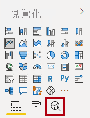

---
lab:
  title: Exercício – Executar Análise Avançada com Visuais de IA
  module: Perform Data Analysis in Power BI
---

# **Executar a análise de dados no Power BI Desktop**

## **História do laboratório**

Neste laboratório, você criará o relatório **Exploração de Vendas**.

Neste laboratório, você aprenderá a:

- Criar gráficos de dispersão animados
- Usar um visual para prever valores

**Este exercício levará aproximadamente 20 minutos.**

## **Tarefa 1: Introdução – Conectar-se**

Nesta tarefa, você vai configurar o ambiente para o laboratório entrando no Power BI.

Se você já entrou no Power BI, continue na próxima tarefa.

1. Para abrir o Microsoft Edge, na barra de tarefas, selecione o atalho do programa Microsoft Edge.

     

1. Na janela do navegador Microsoft Edge, navegue até **https://app.powerbi.com**.

    Use também o favorito do serviço do Power BI na barra de favoritos do Microsoft Edge.

1. Conclua o processo de entrada com suas credenciais organizacionais (ou fornecidas). Se você receber um aviso do Microsoft Edge para permanecer conectado, selecione **Sim**.

1. Na janela do navegador Microsoft Edge, no serviço do Power BI, no painel **Navegação**, expanda **Meu Workspace**. Mantenha a janela do navegador Microsoft Edge aberta.

     

## Tarefa 2: Introdução – Criar um conjunto de dados

Nesta tarefa, você vai configurar o ambiente para o laboratório criando um conjunto de dados. *Se você já publicou o conjunto de dados, vá para a próxima tarefa.*

1. Na janela do navegador Microsoft Edge, no serviço do Power BI, no painel Navegação, expanda Meu Workspace.

1. Selecione Carregar e Procurar.

1. Navegue até a **pasta D:\PL300\Labs\08-perform-data-analysis-in-power-bi-desktop\Starter** .

1. Selecione o arquivo **Sales Analysis.pbix** e escolha **Abrir**.

    Caso precise substituir o conjunto de dados, selecione Substituir.

*Esse método criará um relatório e um conjunto de dados. Usaremos apenas o conjunto de dados para criar um novo relatório neste exercício. Esse mesmo processo poderia ser feito com um conjunto de dados existente de um relatório diferente em vez de carregar novo. Além disso, se você não estiver usando o relatório, as práticas recomendadas do espaço de trabalho sugerem que você exclua o arquivo desnecessário.*

## Criar o relatório

Nesta tarefa, você criará uma conexão em tempo real com o conjunto de dados do Power BI criado na última tarefa e, em seguida, criará um novo **relatório de Exploração de Vendas** .

1. Abra o Power BI Desktop.

    

    Se você já tem o Power BI Desktop aberto (de um laboratório anterior), feche essa instância.

    *Dica: por padrão, a caixa de diálogo Introdução é aberta na frente do Power BI Desktop. Você pode optar por entrar e, em seguida, fechar o pop-up.*

1. No Power BI Desktop: na faixa de opções da Página Inicial, selecione Obter dadosConjuntos de dados do Power BI.

1. Na janela Hub **** de dados, selecione o conjunto de dados Análise** de Vendas em **Meu Espaço de Trabalho** e conecte** **ou clique duas vezes para carregar o **conjunto de dados.

1. Navegue até **Arquivo > Salve e salve** o nome do arquivo como **Exploração de **Vendas** na pasta D:\PL300\MySolution**.

Agora, você criará quatro páginas de relatório e, em cada página, trabalhará com outro visual para analisar e explorar os dados.

## Criar um gráfico de dispersão animado

Nesta tarefa, você criará um gráfico de dispersão que poderá ser animado.

1. Renomeie **Página 1** como **Gráfico de Dispersão**.

1. Adicione um visual de gráfico de dispersão à página do relatório e posicione-o e redimensione-o para que ele preencha a página inteira.
    
    O gráfico pode ser animado quando um campo é adicionado à caixa Eixo de Reprodução.

     

     

1. Adicione os seguintes campos às caixas de visual:
    
    *Os laboratórios usam uma notação taquigráfica para fazer referência a um campo. Ficará assim: **Tipo de Negócio** do Revendedor******\|**. Neste exemplo, **Revendedor** é o nome da tabela e **Tipo de Negócio** é o nome do campo.*

     - Eixo X: **Vendas \|**
     - Eixo Y: **Margem de Lucro de Vendas \|**
     - Revendedor | Tipo de Atividade Comercial
     - Tamanho: **Quantidade de vendas \|**
     - Eixo de reprodução: **Data \| Trimestre**

1. No painel **Filtros**, adicione o campo **Produto | Categoria\| à caixa **Filtros nesta página.

1. No cartão de filtro, filtre-o por **Bicicletas**.

1. Para animar o gráfico, no canto inferior esquerdo, selecione **Reproduzir**.

    

1. Assista a todo o ciclo de animação de **AF2018 T1** a **AF2020 T4**.
    
    O gráfico de dispersão permite entender os valores de medida simultaneamente: nesse caso, a quantidade de pedidos, a receita de vendas e a margem de lucro.
    
    *Cada bolha representa um tipo de negócio de revendedor. As alterações no tamanho da bolha refletem quantidades de ordem aumentadas ou diminuídas. Enquanto os movimentos horizontais representam aumentos/diminuições na receita de vendas, e os movimentos verticais representam aumentos/diminuições na lucratividade.*

1. Quando a animação for concluída, selecione uma das bolhas para revelar o acompanhamento dela ao longo do tempo.

1. Focalize o cursor sobre qualquer bolha para revelar uma dica de ferramenta que descreve os valores da medida para o tipo de revendedor nesse ponto no tempo.

1. No painel **Filtros**, filtre-o por somente **Roupas** e observe que ele produz um resultado muito diferente.

1. Salve o arquivo do Power BI Desktop.

## Criar uma previsão

Nesta tarefa, você criará uma previsão para determinar possíveis receitas de vendas futuras.

1. Adicione uma nova página e renomeie-a como **Previsão**.

1. Adicione um visual **Gráfico de Linhas** à página do relatório e reposicione-o e redimensione-o para que ele preencha a página inteira.

     

     

1. Adicione os seguintes campos às caixas de visual:

     - Eixo X: **Data \| Data**
     - Eixo Y: **Vendas \|**

1. No painel **Filtros**, adicione o campo **Data | Ano\| à caixa **Filtros nesta página.

1. No cartão de filtro, filtre-o por dois anos:
    
    Ao prever uma linha de tempo, você precisará ter, pelo menos, dois ciclos (anos) de dados para produzir uma previsão precisa e estável.

1. Adicione também o campo **Produto | Categoria\| à caixa **Filtros Nesta Página** e filtre-o por **Bicicletas.

1. Para adicionar uma previsão, abaixo do painel **Visualizações**, selecione o painel **Análise**.

     

8. Expanda a seção **Previsão**.
    
    *Se a **seção Previsão** não estiver disponível, provavelmente é porque o visual não foi configurado corretamente. A previsão só está disponível quando duas condições são atendidas: o eixo tem um único campo de data de tipo e há apenas um campo de valor.*

1. Ative a **opção **** Previsão**.

1. Configure as seguintes propriedades de previsão:

    - Unidades: **Meses**
    - Duração da previsão: 1 mês
    - Sazonalidade: 365
    - Intervalo de confiança: 80%

    

1. No visual de linha, observe que a previsão se estendeu para um mês além dos dados históricos.
    
    Quanto maior a confiança, provavelmente, menos estável e, portanto, menos precisa será a previsão.
    
    Quando você souber a duração do ciclo, nesse caso, anual, insira os pontos de sazonalidade.

1. No painel **Filtros**, filtre-o por somente **Roupas** e observe que ele produz um resultado diferente.

### Conclusão

Nesta tarefa, você concluirá o laboratório.

1. Selecione a página **Gráfico de Dispersão**.

1. Salve o arquivo do Power BI Desktop.

1. Para publicar o arquivo no seu workspace, na guia de faixa de opções Página Inicial, no grupo Compartilhar, clique em Publicar.

    

1. Feche o Power BI Desktop.
