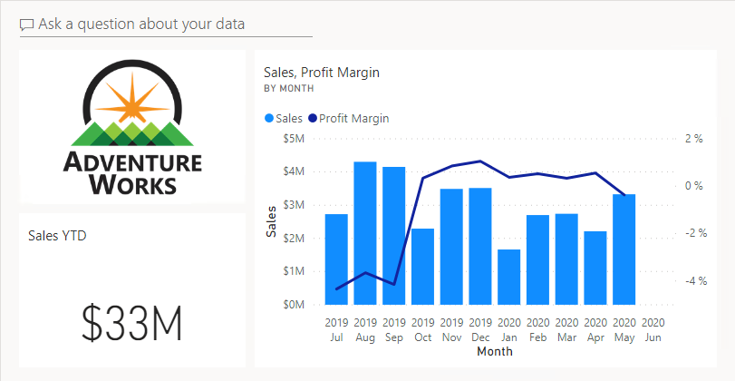

---
lab:
  title: Criar um Painel do Power BI
  module: Create Dashboards
---

# Criar um Painel do Power BI

## História do laboratório

Neste laboratório, você criará o painel **Monitoramento de Vendas** no serviço do Power BI usando um relatório existente.

Neste laboratório, você aprenderá a:

- Fixar visuais a um dashboard
- Usar P e R para criar blocos de dashboard

**Este laboratório levará aproximadamente 30 minutos.**

## Introdução

Para concluir este exercício, primeiro abra um navegador da Web e insira a seguinte URL para baixar a pasta zip:

`https://github.com/MicrosoftLearning/PL-300-Microsoft-Power-BI-Data-Analyst/raw/Main/Allfiles/Labs/09-create-power-bi-dashboard/09-create-dashboard.zip`

Extraia a pasta para a pasta **C:\Users\Student\Downloads\09-create-dashboard**.

## **Publicar o relatório**

Nesta tarefa, você vai configurar o ambiente para o laboratório criando um modelo semântico.

1. Na janela do navegador Microsoft Edge, no serviço do Power BI, navegue para **Meu Workspace**.

1. Selecione **Carregar > Procurar**.

1. Navegue até a pasta **C:\Users\Student\Downloads\09-create-dashboard**.

1. Clique no arquivo **09-Starter-Sales Analysis.pbix** e depois em **Abrir**.

    > *Caso precise substituir o modelo semântico, selecione **Substituir**.*

## **Criar um painel**

Nesta tarefa, você criará o painel **Monitoramento de Vendas**. Você fixará um visual por meio do relatório, adicionará um bloco com base em um URI de dados de imagem e usará a P e R para criar um bloco.

1. No serviço do Power BI, abra o relatório **09-Starter-Sales Analysis**.

1. Na página **Visão geral**, defina a segmentação **Year** como **FY2020**.

    

1. Defina a segmentação **Região** como **Selecionar Tudo**.

    > *Os elementos visuais fixados são definidos com o contexto do filtro no momento da fixação. Se o visual subjacente for alterado, você também precisará atualizar o bloco do painel. Para filtros baseados em tempo, é melhor usar uma segmentação de dados relativa (ou, Perguntas e respostas usando uma pergunta baseada em tempo relativo).*

1. Para criar um dashboard e fixar um visual, posicione o cursor sobre o visual **Vendas e Margem de Lucro por Mês** (coluna/linha).

    

1. Na janela **Fixar ao Painel**, na caixa **Nome do Painel**, insira **Monitoramento de Vendas** e selecione **Fixar**.

    

1. Abra **Meu Workspace** e abra o painel **Monitoramento de Vendas**.

1. Observe que o dashboard tem um só bloco.

    

1. Para adicionar um bloco com base em uma pergunta, no canto superior esquerdo do dashboard, selecione **Fazer uma Pergunta sobre os Dados**. 

    *Você pode usar o recurso de perguntas e respostas para fazer uma pergunta, e o Power BI responderá com um visual.*

    

1. Selecione uma das perguntas sugeridas abaixo da caixa de P e R e analise a resposta.

1. Remova todo o texto da caixa de Perguntas e Respostas e digite o seguinte: **Vendas YTD**

1. Observe a resposta **(Em Branco)**.

    > *Você deve se lembrar de ter adicionado a medida **Vendas YTD** no laboratório **Criar Cálculos DAX Avançados no Power BI Desktop**. Essa medida é uma expressão de Inteligência de Dados Temporais e também requer um filtro na tabela **Data** para gerar um resultado.*

    

1. Especifique a pergunta com: **no ano FY2020**.

1. Observe que a resposta agora é **US$33 milhões**.

    

1. Para fixar a resposta no painel, no canto superior direito, selecione **Fixar Visual**.

    

1. Quando precisar fixar o bloco no painel **Monitoramento de Vendas** clique em **Fixar**.

1. Para voltar ao painel, no canto superior esquerdo, selecione **Sair das Perguntas&amp;Respostas**.

1. Para adicionar o logotipo da empresa, na barra de menus, selecione **Editar** e **Adicionar um Bloco**.
    
    > *O uso dessa técnica para adicionar um bloco do painel permite aprimorar o painel com uma mídia, incluindo conteúdo da Web, imagens, caixas de texto com formatação e vídeos (usando links do YouTube ou do Vimeo).*

1. No painel **Adicionar um Bloco** (localizado à direita), selecione o bloco **Imagem** e, em seguida, **Avançar**.

1. No painel **Adicionar bloco de imagem**, na caixa **URL**, digite o URL completo encontrado no arquivo **C:\Users\Student\Downloads\09-create-dashboard\AdventureWorksLogo_DataURL.txt** e clique em **Aplicar**.
    
    > *Você pode inserir uma imagem usando a URL dela ou uma URL de dados, que insere o conteúdo embutido.*

1. Para redimensionar o bloco do logotipo, arraste o canto inferior direito e redimensione o bloco até que ele tenha uma unidade de largura e uma de altura.
    
    > *Os tamanhos dos blocos são limitados a uma forma retangular.*

1. Organize os blocos para que o logotipo seja mostrado no canto superior esquerdo, com o bloco **Vendas acumuladas no ano** abaixo dele e o bloco **Vendas, Margem de Lucro** à direita.

    

## **Editar detalhes do bloco**

Nesta tarefa, você editará os detalhes de dois blocos.

1. Posicione o cursor sobre o bloco **Vendas acumuladas no ano** e, no canto superior direito do bloco, selecione as reticências e escolha **Editar Detalhes**.

    

1. No painel **Detalhes do Bloco** (localizado à direita), na caixa **Subtítulo**, insira **FY2020** e, em seguida, selecione **Aplicar**.

1. Observe que o bloco **Vendas acumuladas no ano** exibe um subtítulo.

    

1. Edite os detalhes do bloco para o bloco **Vendas, Margem de Lucro**.

1. No painel **Detalhes do Bloco**, na seção **Funcionalidade**, marque **Exibir a Hora da Última Atualização** e, em seguida, selecione **Aplicar**.

    

1. Observe que o bloco descreve a hora da última atualização (que foi realizada ao carregar o modelo de dados no Power BI Desktop).

*Você atualizará o modelo semântico no próximo exercício. Dependendo dos seus dados e relatório, você pode fazer uma atualização de dados adhoc a qualquer momento ou definir uma agenda. No entanto, as atualizações agendadas exigem gateways que não podemos configurar para este laboratório. Portanto, no Power BI Desktop, você executará uma atualização de dados manual e carregará o arquivo em seu workspace.*

## **Atualizar o modelo semântico**

Neste exercício, primeiro, você carregará os dados de pedidos de vendas de junho de 2020 no banco de dados **AdventureWorksDW2020**. Depois, você abrirá o arquivo do Power BI Desktop, executará uma atualização de dados e carregará o arquivo no seu workspace.

> ***Observação**: se você não conseguir se conectar ao banco de dados, poderá usar o arquivo **09-Solution-Sales-Analysis.pbix**. Em vez de atualizar o banco de dados e atualizar o modelo semântico, carregue o arquivo de solução em **Meu workspace** e veja as alterações referenciadas nas tarefas a seguir.*

## **Atualizar o banco de dados do laboratório**

Nesta tarefa, você executará um script do PowerShell para atualizar os dados do banco de dados **AdventureWorksDW2020**.

1. No Explorador de Arquivos, na pasta **C:\Users\Student\Downloads\09-create-dashboard**, clique com o botão direito do mouse no arquivo **UpdateDatabase-2-AddSales.ps1** e clique em **Executar com o PowerShell**.

    

1. Caso precise alterar a política de execução, clique em **A**.

1. Quando for solicitado a pressionar qualquer tecla para fechar, pressione **Enter** novamente.

*Agora o banco de dados **AdventureWorksDW2020** inclui pedidos de vendas de junho de 2020.*

## **Atualizar o arquivo do Power BI Desktop**

Nesta tarefa, você abrirá o arquivo **09-Starter-Sales Analysis** do Power BI Desktop, executará uma atualização de dados e fará o upload do arquivo para o seu espaço de trabalho **Análise de Vendas**.

1. No arquivo do Power BI Desktop, no painel **Data**, clique com o botão direito do mouse na tabela **Vendas** e selecione **Atualizar Dados**.

    

1. Quando a atualização for concluída, salve o arquivo do Power BI Desktop.

1. Para publicar o arquivo no seu workspace, na guia de faixa de opções **Página Inicial**, no grupo **Compartilhar**, selecione **Publicar** e **Selecionar** para publicar.

    

1. Quando precisar substituir o modelo semântico, selecione **Substituir**.

1. Feche o Power BI Desktop.

*Agora, a data de vendas do modelo semântico no serviço do Power BI é junho de 2020.*

### **Examinar o painel**

Nesta tarefa, você examinará o painel para observar as vendas atualizadas.

1. Na janela do navegador Microsoft Edge, no serviço do Power BI, examine o painel **Monitoramento de Vendas** em **Meu Workspace**.

2. No bloco **Vendas, Margem de Lucro**, no subtítulo, observe que os dados são **Atualizados: AGORA**.

3. Observe também que agora há uma coluna para **junho de 2020**.

    > *Se os dados de junho de 2020 não forem exibidos, clique em **F5** para recarregar o navegador da Web.*

    

## Laboratório concluído
