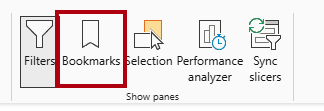

---
lab:
  title: Aprimorar os designs de relatório do Power BI
  module: Enhance Power BI report designs for the user experience
---

# Aprimorar design de relatório do Power BI

## História do laboratório

Neste laboratório, você vai aprimorar o relatório _Análise de Vendas_ com recursos de design avançados.

Neste laboratório, você aprenderá a:

- Criar uma página de detalhamento.
- Aplicar formatação condicional.
- Criar e usar indicadores e botões.

**Este laboratório levará aproximadamente 45 minutos.**

## Introdução

Para concluir este exercício, primeiro abra um navegador da Web e insira a seguinte URL para baixar o arquivo zip:

`https://github.com/MicrosoftLearning/PL-300-Microsoft-Power-BI-Data-Analyst/raw/Main/Allfiles/Labs/09-enhance-power-bi-reports/09-enhanced-report.zip`

Extraia o arquivo para a pasta **C:\Users\Student\Downloads\09-enhanced-report**.

Abra o arquivo **09-Starter-Sales Analysis.pbix**.

> _**Observação**: você pode ignorar a entrada clicando em **Cancelar**. Feche todas as janelas informativas. Caso precise aplicar as alterações, clique em **Aplicar depois**._

## Configurar uma página de detalhamento

Neste exercício, você vai criar uma página e vai configurá-la como uma página de detalhamento. Quando você tiver concluído o design, a página terá a seguinte aparência:

1. Crie uma página e renomeie-a como _Detalhes do Produto_.

1. Clique com o botão direito do mouse na guia da página **Detalhes do Produto** e selecione **Ocultar Página**.

    > _Os usuários de relatório não poderão acessar a página de detalhamento diretamente. Em vez disso, eles a acessarão dos visuais em outras páginas. Você vai aprender fazer o detalhamento da página no exercício final deste laboratório._

1. Embaixo do painel **Visualizações**, na seção **Detalhamento**, adicione o campo `Product | Category` à caixa **Adicionar campos de detalhamento aqui**.

    > _Os laboratórios usam uma notação abreviada para referenciar um campo. Ele terá a seguinte aparência: `Product | Category`. Neste exemplo, `Product` é o nome da tabela e `Category` é o nome do campo._

    

1. Para testar a página de detalhamento, no cartão de filtro de detalhamento, selecione _Bicicletas_.

    

1. Na parte superior esquerda da página de relatório, observe o botão de seta.

    > _O Designer de Relatórios adiciona automaticamente um botão de seta quando um campo é adicionado à caixa de detalhamento. Ele permite que os usuários de relatório naveguem de volta para a página na qual eles fizeram detalhamento._

1. Adicione um visual **Cartão** à página e redimensione-o e posicione-o para que ele fique à direita do botão e preencha a largura restante da página.

    

    

1. Arraste o campo `Product | Category` para o visual do cartão.

1. Configure as opções de formato para o visual e transforme a propriedade **Rótulo da Categoria** em **Desativado**.

    

1. Na guia **Geral**, na seção **Efeitos**, defina a propriedade de cor da tela de fundo como uma cor cinza claro (como _Branco, 10% Mais Escuro_) para dar contraste.

    

1. Adicione um visual **Tabela** à página e redimensione-o e posicione-o para que ele fique embaixo do visual de cartão e preencha o espaço restante na página.

    

    

1. Adicione os seguintes campos ao visual:

    - `Product | Subcategory`
    - `Product | Color`
    - `Sales | Quantity`
    - `Sales | Sales`
    - `Sales | Profit Margin`

1. Para configurar as opções de formato para o visual, na seção **Grade**, defina a propriedade **Tamanho da fonte global** como **20pt**.

    > _O design da página de detalhamento está quase concluído. Você vai aprimorar a página com a formatação condicional no próximo exercício._

## Adicionar formatação condicional

Neste exercício, você vai aprimorar a página de detalhamento com formatação condicional. Quando você tiver concluído o design, a página terá a seguinte aparência:

1. Selecione o visual de tabela. Na caixa **Colunas**, selecione a seta suspensa no campo **Margem de Lucro** e escolha **Formatação Condicional > Ícones**.

    

1. Na janela **Ícones – Margem de Lucro**, na lista suspensa **Layout do Ícone**, selecione **À Direita dos Dados**.

    

1. Para excluir a regra intermediária, à esquerda do triângulo amarelo, selecione **X**.

    

1. Configure a primeira regra (losango vermelho) da seguinte maneira:

    - No segundo controle, remova o valor
    - No terceiro controle, selecione **Número**
    - No quinto controle, digite **0**
    - No sexto controle, selecione **Número**

1. Configure a segunda regra (círculo verde) da seguinte maneira:

    - No segundo controle, digite **0**
    - No terceiro controle, selecione **Número**
    - No quinto controle, remova o valor
    - No sexto controle, selecione **Número**

    

    > _As regras podem ser interpretadas assim: exiba um losango vermelho se o valor da margem de lucro for menor que 0; caso contrário, se o valor for maior ou igual a zero, exiba um círculo verde._

1. Na janela **Ícones – Margem de Lucro**, na lista suspensa **Aplicar**, selecione **Valores e totais**.

    

1. Selecione **OK**.

1. No visual da tabela, verifique se os ícones corretos são exibidos.

    

1. Configure a formatação condicional de cor da tela de fundo para o campo **Cor**.

1. Na janela **Cor da tela de fundo – Cor**, na lista suspensa **Estilo de Formatação**, selecione **Valor do Campo**.

    

1. Na lista suspensa **Em que campo devemos basear isso?**, no grupo _Todos os dados_, selecione o campo `Product | Formatting | Background Color Format`.

    

1. Repita as etapas anteriores para configurar a formatação condicional de cor da fonte para o campo **Cor**, usando o campo `Product | Formatting | Font Color Format`.

 > _Talvez você se lembre de que as cores da tela de fundo e da fonte foram obtidas do arquivo **ColorFormats.csv** no laboratório **Preparar Dados no Power BI Desktop** e integradas à consulta **Produto** no laboratório **Carregar Dados no Power BI Desktop**._

## Adicionar indicadores e botões

Neste exercício, você vai aprimorar a página _Meu Desempenho_ com botões, permitindo que o usuário do relatório selecione o tipo de visual a ser exibido. Quando você tiver concluído o design, a página terá a seguinte aparência:

1. Acesse a página _Meu Desempenho_.

1. Na guia de faixa de opções **Exibir**, no grupo **Mostrar Painéis**, selecione **Indicadores**.

    

1. Na guia de faixa de opções **Exibir**, no grupo **Mostrar Painéis**, escolha **Seleção**.

    

1. No painel **Seleção**, ao lado de um dos itens de _Vendas e Meta por Mês_, para ocultar o visual, selecione o ícone de olho.

    

1. No painel **Indicadores**, selecione **Adicionar**.

    

    > _Dica: Para renomear o indicador, clique duas vezes no indicador._

1. Se o gráfico visível for o gráfico de barras, renomeie o indicador como _Gráfico de Barras ATIVADO_; caso contrário, renomeie o indicador como _Gráfico de Colunas ATIVADO_.

1. Para editar o indicador, no painel **Indicadores**, posicione o cursor sobre o indicador, clique nas reticências e selecione **Dados**.

    > _A desabilitação da opção **Dados** significa que o indicador não usará o estado atual do filtro. Isso é importante porque, caso contrário, o indicador bloqueará permanentemente o filtro aplicado atualmente pela segmentação Ano._

    

1. Para atualizar o indicador, clique nas reticências novamente e selecione **Atualizar**.

    > _Nas etapas a seguir, você vai criar e configurar um segundo indicador para mostrar o segundo visual._

1. No painel **Seleção**, alterne a visibilidade dos dois itens _Vendas e Meta por Mês_.

    > _Em outras palavras, torne o visual visível oculto e torne o visual oculto visível._

    

1. Crie um segundo indicador e nomeie-o adequadamente (_Gráfico de Colunas ATIVADO_ ou _Gráfico de Barras ATIVADO)._

    

1. Configure o segundo indicador para ignorar filtros (opção **Dados** desativada) e atualize o indicador.

1. No painel **Seleção**, para tornar os dois visuais visíveis, basta mostrar o visual oculto.

1. Redimensione e reposicione os dois visuais para que eles preencham a página embaixo do visual de vários cartões e se sobreponham completamente.

    > _Para selecionar o visual coberto, selecione-o no painel **Seleção**._

    

1. No painel **Indicadores**, selecione cada um dos indicadores e observe que apenas um dos visuais está visível.

    > _O próximo estágio do design é adicionar dois botões à página. Esses botões permitirão que o usuário do relatório selecione os indicadores._

1. Na faixa de opções **Inserir**, no grupo **Elementos**, selecione **Botão** e **Em Branco**.

    

1. Reposicione o botão diretamente abaixo da segmentação _Ano_.

1. Selecione o botão e, no painel do botão **Formatar botão**, expanda a seção **Estilo** e defina a propriedade **Texto** como **Ativa**.

    

1. Na seção **Texto**, na caixa **Texto**, insira _Gráfico de barras_.

1. Defina a seção **Preenchimento** como **Ativado** e, em seguida, defina uma cor usando uma cor complementar.

1. Defina a seção **Ação** como **Ativado** e defina a propriedade de **Tipo** como **Marcar**.

1. Selecione **Botão** e defina a propriedade **Ação** como **Ativa**.

1. Expanda a seção **Ação** e defina a lista suspensa **Tipo** como **Indicador**.

1. Na lista suspensa **Indicador**, selecione **Gráfico de Barras ATIVADO**.

    

1. Crie uma cópia do botão usando copiar e colar e configure o novo botão da seguinte maneira:

    > _Dica: os comandos de atalho para copiar e colar o conteúdo são **Ctrl+C** seguido de **Ctrl+V**._

    - Defina o texto do botão como _Gráfico de Colunas_.
    - Defina o indicador de ação como **Gráfico de Colunas ATIVADO**.

    > _Agora, o design do relatório Análise de Vendas está completo._

## Publicar e explorar o relatório

Neste exercício, você publicará o relatório no serviço do Power BI e explorará o comportamento do relatório publicado.

> _**Observação**: você precisará de pelo menos uma licença do **Power BI gratuita** para publicar o relatório. Abra o navegador Microsoft Edge e entre em `https://app.powerbi.com`. Quando solicitado a resolver um quebra-cabeça ou iniciar uma avaliação gratuita do Fabric, você poderá ignorar isso e fechar o navegador.

> _**Observação**: você pode examinar o restante do exercício, mesmo que não tenha acesso ao serviço do Power BI para executar as tarefas diretamente._

1. Selecione a página _Visão Geral_.

1. Na segmentação _Ano_, selecione **FY2020**.

1. Na segmentação _Região_, verifique se nenhuma região está selecionada.

1. Salve o arquivo do Power BI Desktop.

1. Na guia de faixa de opções **Página Inicial**, no grupo **Compartilhar**, selecione **Publicar**.

    > _Se você ainda não entrou no Power BI Desktop, precisa entrar para publicar o relatório._

    

1. Na janela **Publicar no Power BI**, observe que _Meu Workspace_ está selecionado.

1. Para publicar o relatório, escolha **Selecionar**. Aguarde até que a publicação seja concluída.

1. Quando a publicação for bem-sucedida, selecione **Entendi**.

1. Feche o Power BI Desktop.

1. Abra o navegador Microsoft Edge e entre em `https://app.powerbi.com` (ou use uma sessão de navegador existente).

1. Na janela do navegador, no serviço do Power BI, no painel **Navegação** (localizado à esquerda, possivelmente recolhido), selecione **Meu Workspace**.

1. Para explorar o relatório, selecione o relatório _09-Starter-Sales Analysis_.

1. Para testar o recurso de detalhamento, na página _Visão geral_, no visual _Soma da Quantidade por Categoria_, clique com o botão direito do mouse na barra _Roupas_ e selecione **Detalhamento > Detalhes do Produto**.

    

1. Observe que a página _Detalhes do Produto_ filtra visuais para _Roupas_.

1. Para voltar à página de origem, no canto superior esquerdo da página, selecione o botão de seta.

1. Acesse a página _Meu Desempenho_.

1. Selecione cada um dos botões e observe que um visual diferente é exibido.

## Laboratório concluído
