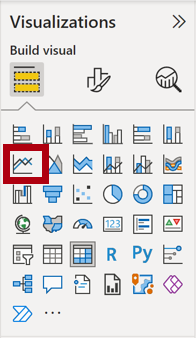

---
lab:
  title: Executar análise no Power BI
  module: Perform analytics in Power BI
---

# Executar análise no Power BI

## História do laboratório

Neste laboratório, você criará o relatório **Exploração de Vendas**.

Neste laboratório, você aprenderá a:

- Criar gráficos de dispersão animados.
- Usar um visual para prever valores.

**Este laboratório levará aproximadamente 30 minutos.**

## Introdução

Para concluir este exercício, primeiro abra um navegador da Web e insira a seguinte URL para baixar a pasta zip:

`https://github.com/MicrosoftLearning/PL-300-Microsoft-Power-BI-Data-Analyst/raw/Main/Allfiles/Labs/10-perform-analytics-power-bi/10-perform-analytics.zip`

Extraia a pasta para a pasta **C:\Users\Student\Downloads\10-perform-analytics**.

1. Abra o arquivo **10-Starter-Sales Analysis.pbix**.

> _**Observação**: Você pode ver uma caixa de diálogo de entrada enquanto o arquivo é carregado. Selecione **Cancelar** para ignorar a caixa de diálogo de entrada. Feche todas as janelas informativas. Caso precise aplicar as alterações, clique em **Aplicar depois**._

## Criar um gráfico de dispersão animado

Nesta tarefa, você criará um gráfico de dispersão que poderá ser animado.

1. Crie uma nova página e nomeie-a como **Gráfico de dispersão**.

1. Adicione um visual de **Gráfico de Dispersão** à página do relatório e posicione-o e redimensione-o para que ele preencha a página inteira.

    > *O gráfico pode ser animado quando um campo é adicionado à caixa/área **Eixo de Reprodução**.*

     

     

1. Adicione os seguintes campos às caixas/áreas de visual:

    > *Os laboratórios usam uma notação taquigráfica para fazer referência a um campo. Ficará assim: **Revendedor****\|****Tipo de Negócio**. Neste exemplo, **Revendedor** é o nome da tabela e **Tipo de Negócio** é o nome do campo.*

     - Eixo X: **Vendas \| Vendas**
     - Eixo Y: **Vendas \| Margem de Lucro**
     - Legenda: **Revendedor \| Tipo de Negócio**
     - Tamanho: **Vendas \| Quantidade**
     - Eixo de Reprodução: **Data \| Trimestre**

1. No painel **Filtros**, adicione o campo **Produto \| Categoria** para a caixa/área **Filtros Nesta Página**.

1. No cartão de filtro, filtre-o por **Bicicletas**.

1. Para animar o gráfico, no canto inferior esquerdo, selecione **Reproduzir**.

    

1. Assista a todo o ciclo de animação de **AF2018 T1** a **AF2020 T4**.

    > *O gráfico de dispersão permite entender os valores de medida simultaneamente: nesse caso, a quantidade de pedidos, a receita de vendas e a margem de lucro.*
    > 
    > *Cada bolha representa um tipo de negócio de revendedor. As alterações no tamanho da bolha refletem quantidades de ordem aumentadas ou diminuídas. Enquanto os movimentos horizontais representam aumentos/diminuições na receita de vendas, e os movimentos verticais representam aumentos/diminuições na lucratividade.*

1. Quando a animação for concluída, selecione uma das bolhas para revelar o acompanhamento dela ao longo do tempo.

1. Focalize o cursor sobre qualquer bolha para revelar uma dica de ferramenta que descreve os valores da medida para o tipo de revendedor nesse ponto no tempo.

1. No painel **Filtros**, filtre-o por somente **Roupas** e observe que ele produz um resultado muito diferente.

1. Salve o arquivo do Power BI Desktop.

## Criar uma previsão

Nesta tarefa, você criará uma previsão para determinar possíveis receitas de vendas futuras.

1. Adicione uma nova página e renomeie-a como **Previsão**.

1. Adicione um visual **Gráfico de Linhas** à página do relatório e reposicione-o e redimensione-o para que ele preencha a página inteira.

     

     

1. Adicione os seguintes campos às caixas/áreas de visual:

     - Eixo X: **Data \| Data**
     - Eixo Y: **Vendas \| Vendas**

1. No painel **Filtros**, adicione o campo **Data \| Ano** à caixa/área **Filtros Nesta Página**.

1. No cartão de filtro, filtre-o por dois anos: **FY2019** e **FY2020**.

    > *Ao prever uma linha de tempo, você precisará ter, pelo menos, dois ciclos (anos) de dados para produzir uma previsão precisa e estável.*

1. Adicione também o campo **Produto \| Categoria** à caixa/área **Filtros Nesta Página** e filtre-o por **Bicicletas**.

1. Para adicionar uma previsão, abaixo do painel **Visualizações**, selecione o painel **Análise**.

     

1. Expanda a seção **Previsão**.

    > *Se a seção **Previsão** não estiver disponível, provavelmente é porque o visual não foi configurado corretamente. A previsão só está disponível quando duas condições são atendidas: o eixo tem um único campo de data de tipo e há apenas um campo de valor.*

1. Defina a opção **Previsão** como **Ativado**.

1. Configure as seguintes propriedades de previsão e clique em **Aplicar**:

    - Unidades: **Meses**
    - Duração da previsão: **1 mês**
    - Sazonalidade: **365**
    - Intervalo de confiança: **80%**

    

1. No visual de linha, observe que a previsão se estendeu para um mês além dos dados históricos.

    > *A área cinza representa a confiança. Quanto maior a confiança, provavelmente, menos estável e, portanto, menos precisa será a previsão.*
    >
    > *Quando você souber a duração do ciclo, nesse caso, anual, insira os pontos de sazonalidade. Às vezes, a duração pode ser semanal (7) ou mensal (30).*

1. No painel **Filtros**, filtre-o por somente **Roupas** e observe que ele produz um resultado diferente.

## Laboratório concluído

Você pode optar por salvar seu relatório do Power BI, embora isso não seja necessário para este laboratório. No próximo exercício, você trabalhará com um arquivo inicial pré-criado.

1. Navegue até o menu **"Arquivo"** no canto superior esquerdo e selecione **"Salvar como"**. 
1. Selecione **Procurar neste dispositivo**.
1. Selecione a pasta na qual você deseja salvar o arquivo e dê a ele um nome descritivo. 
1. Selecione o botão **Salvar** para salvar o relatório como um arquivo .pbix. 
1. Se for exibida uma caixa de diálogo solicitando a aplicação das alterações de consulta pendentes, selecione **Aplicar**.
1. Feche o Power BI Desktop.