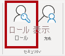
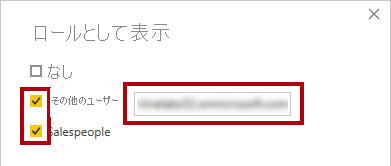
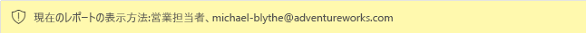

---
lab:
  course: PL-300
  title: Impor a Segurança em Nível de Linha
  module: Enforce Row-Level Security
---


# **Impor a Segurança em Nível de Linha**

## **História do laboratório**

Neste laboratório, você vai impor a segurança em nível de linha para garantir que cada vendedor só possa analisar dados de vendas para as regiões atribuídas a ele.

Neste laboratório, você aprenderá a:

- Impor a Segurança em Nível de Linha
- Escolher entre métodos dinâmicos e estáticos

**Este laboratório levará aproximadamente 20 minutos.**

## **Introdução**

Nesta tarefa, você vai configurar o ambiente para o laboratório.

*Importante: se estiver dando continuidade ao laboratório anterior (e concluiu esse laboratório com sucesso), não conclua essa tarefa; em vez disso, continue na próxima tarefa.*

1. Abra o Power BI Desktop.

    

1. Para abrir o arquivo inicial do Power BI Desktop, slecione **Abrir > Procurar neste dispositivo**.

1. Na janela **Abrir**, navegue até a pasta **D:\Allfiles\Labs\10 linha-level-security\Starter** e abra o arquivo **Análise de Vendas**.

   *Observação: neste momento, o Power BI solicitará que você entre se ainda não tiver entrado. Você pode entrar ou clicar em **Cancelar** e continuar o laboratório.*

1. Feche todas as janelas informativas que possam ser abertas.

1. Observe a mensagem de aviso abaixo da faixa de opções. *Essa mensagem alerta para o fato de que as consultas não foram aplicadas para carregar como tabelas de modelo. Você aplicará as consultas posteriormente neste laboratório.*
    
    *Para ignorar a mensagem de aviso, à direita da mensagem de aviso, selecione **X**.*

1. Para criar uma cópia do arquivo, vá para **Arquivo > Salvar como** e salve na pasta **D:\Allfiles\MySolution**.

1. Caso precise aplicar as alterações, selecione **Aplicar Mais Tarde**.

## **Impor a segurança em nível de linha**

Nesta tarefa, você vai impor a segurança em nível de linha para garantir que um vendedor só possa ver as vendas feitas nas regiões atribuídas a ele.

1. Alternar para a exibição de Tabela.

   

1. No painel **Data**, selecione a tabela **Vendedor (Desempenho)**.


1. Examine os dados, observando que Michael Blythe (EmployeeKey 281) tem um valor UPN igual a: **michael-blythe@adventureworks.com**
    
    *Você deve se lembrar que Michael Blythe foi atribuído a três regiões de vendas: Nordeste dos EUA, EUA Central e Sudeste dos EUA.*

1. Na guia de faixa de opções **Página inicial**, no grupo **Segurança**, selecione **Gerenciar Funções**.

    

1. Na janela **Gerenciar funções de segurança**, na seção **Funções**, clique em **Novo**.

1. Na caixa, substitua o texto selecionado pelo nome da função: **Vendedores** e pressione **Enter**.

   

1. Para atribuir um filtro, clique na tabela **Vendedor (Desempenho)** e, em seguida, selecione **Alternar para o editor DAX** na seção **Filtrar dados**.

   

1. No editor do DAX, digite a expressão a seguir:

    **DAX**

    ```
    [UPN] = USERPRINCIPALNAME()
    ```
    
    *USERPRINCIPALNAME() é uma função DAX (Data Analysis Expressions) que retorna o nome do usuário autenticado. Isso significa que a tabela **Vendedor (Desempenho)** será filtrada pelo UPN (Nome Principal do Usuário) do usuário que está consultando o modelo.*

   

1. Selecione **Salvar** e **Fechar**.

1. Para testar a função de segurança, na guia de faixa de opções **Página inicial**, no grupo **Segurança**, selecione **Exibir como**.

   

1. Na janela **Exibir como Funções**, marque o item **Outro Usuário** e, na caixa correspondente, insira: **michael-blythe@adventureworks.com**

1. Verifique a função **Vendedores** e, em seguida, **OK**.
    
    *Essa configuração resulta no uso da função **Vendedores** e na representação do usuário com o nome de Michael Blythe.*

   

1. Observe a faixa amarela acima da página do relatório, descrevendo o contexto de segurança do teste.

   

1. No visual de tabela, observe que só o vendedor **Michael Blythe** está listado.

   

1. Para interromper o teste, no lado direito da faixa amarela, selecione **Parar de Exibir**.

   

1. Para excluir a função **Vendedor**, na guia de faixa de opções **Página Inicial**, no grupo **Segurança**, selecione **Gerenciar Funções**.

   

1. Na janela **Gerenciar funções de segurança**, clique nas reticências (...) na função **Vendedor** e clique em **Excluir**. Quando precisar confirmar a exclusão, selecione **Sim, Excluir**.

   

### **Conclusão**

Nesta tarefa, você concluirá o laboratório.

1. Selecione **Salvar** e salve o arquivo do Power BI Desktop para encerrar o laboratório.

*Observação: quando o arquivo do Power BI Desktop for publicado no serviço do Power BI, você precisará concluir uma tarefa de pós-publicação para mapear entidades de segurança para a função **Vendedores**. Isso não será feito neste laboratório.*
