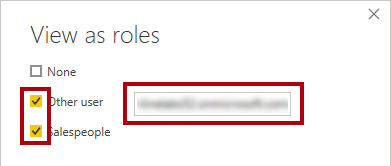
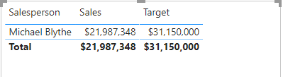

---
lab:
  title: Acesso seguro aos dados no Power BI
  module: Secure data access in Power BI
---

# Acesso seguro aos dados no Power BI

## História do laboratório

Neste laboratório, você vai impor a segurança em nível de linha para garantir que cada vendedor só possa analisar dados de vendas para as regiões atribuídas a ele. Você irá impor a segurança em nível de linha usando o método dinâmico.

**Este laboratório levará aproximadamente 20 minutos.**

## Introdução

Para concluir este exercício, primeiro abra um navegador da Web e insira a seguinte URL para baixar a pasta zip:

`https://github.com/MicrosoftLearning/PL-300-Microsoft-Power-BI-Data-Analyst/raw/Main/Allfiles/Labs/11-secure-data-access/11-secure-data.zip`

Extraia a pasta para a pasta**C:\Users\Student\Downloads\11-secure-data**.

Abra o arquivo**11-Starter-Sales Analysis.pbix**.

> _**Observação**: Você pode ver uma caixa de diálogo de entrada enquanto o arquivo é carregado. Selecione**Cancelar** para ignorar a caixa de diálogo de entrada. Feche todas as janelas informativas. Caso precise aplicar as alterações, clique em**Aplicar depois**._

## Impor a segurança em nível de linha

Nesta tarefa, você vai impor a segurança em nível de linha para garantir que um vendedor só possa ver as vendas feitas nas regiões atribuídas a ele.

1. Alternar para a**modo de exibição Tabela**.

   

1. No painel**Data**, selecione a tabela**Vendedor (Desempenho)**.

1. Examine os dados, observando que Michael Blythe (EmployeeKey 281) tem um valor UPN igual a:**`michael-blythe@adventureworks.com`**
    
    > *Você deve se lembrar que Michael Blythe foi atribuído a três regiões de vendas: Nordeste dos EUA, EUA Central e Sudeste dos EUA.*

1. Na guia de faixa de opções**Página inicial**, no grupo**Segurança**, selecione**Gerenciar Funções**.

    

1. Na janela**Gerenciar funções de segurança**, na seção**Funções**, clique em**Novo**.

1. Na caixa, substitua o texto selecionado pelo nome da função:**Vendedores** e pressione**Enter**.

   

1. Para atribuir um filtro, clique na tabela**Vendedor (Desempenho)** e, em seguida, selecione**Alternar para o editor DAX** na seção**Filtrar dados**.

   

1. No editor do DAX, digite a expressão a seguir:

    ```DAX
    [UPN] = USERPRINCIPALNAME()
    ```

   

    > *USERPRINCIPALNAME() é uma função DAX (Data Analysis Expressions) que retorna o nome do usuário autenticado. Isso significa que a tabela**Vendedor (Desempenho)** será filtrada pelo UPN (Nome Principal do Usuário) do usuário que está consultando o modelo.*

1. Selecione**Salvar** e**Fechar**.

1. Para testar a função de segurança, na guia de faixa de opções**Página inicial**, no grupo**Segurança**, selecione**Exibir como**.

   

1. Na janela**Exibir como Funções**, marque o item**Outro Usuário** e, na caixa correspondente, insira:**`michael-blythe@adventureworks.com`**

1. Verifique a função**Vendedores** e, em seguida,**OK**.
    
    > *Essa configuração resulta no uso da função**Vendedores** e na representação do usuário com o nome de Michael Blythe.*

   

1. Observe a faixa amarela acima da página do relatório, descrevendo o contexto de segurança do teste.

   

1. No visual de tabela, observe que só o vendedor**Michael Blythe** está listado.

   

1. Para interromper o teste, no lado direito da faixa amarela, selecione**Parar de Exibir**.

   

1. Para excluir a função**Vendedor**, na guia de faixa de opções**Página Inicial**, no grupo**Segurança**, selecione**Gerenciar Funções**.

   

1. Na janela**Gerenciar funções de segurança**, clique nas reticências (...) na função**Vendedor** e clique em**Excluir**. Quando precisar confirmar a exclusão, selecione**Sim, Excluir**.

   

*Observação: quando o arquivo do Power BI Desktop for publicado no serviço do Power BI, você precisará concluir uma tarefa de pós-publicação para mapear entidades de segurança para a função**Vendedores**. Isso não será feito neste laboratório.*

## Laboratório concluído

Você pode optar por salvar seu relatório do Power BI, embora isso não seja necessário para este laboratório. 

1. Feche a janela do navegador Microsoft Edge.
1. No Power BI Desktop, navegue até o menu **"Arquivo"** no canto superior esquerdo e selecione **"Salvar como"**. 
1. Selecione**Procurar neste dispositivo**.
1. Selecione a pasta na qual você deseja salvar o arquivo e dê a ele um nome descritivo. 
1. Selecione o botão**Salvar** para salvar o relatório como um arquivo .pbix. 
1. Se for exibida uma caixa de diálogo solicitando a aplicação das alterações de consulta pendentes, selecione**Aplicar**.
1. Feche o Power BI Desktop.
